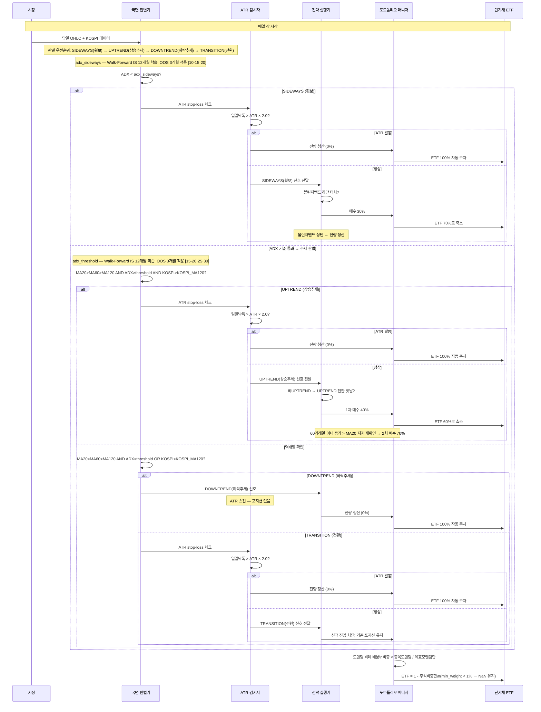
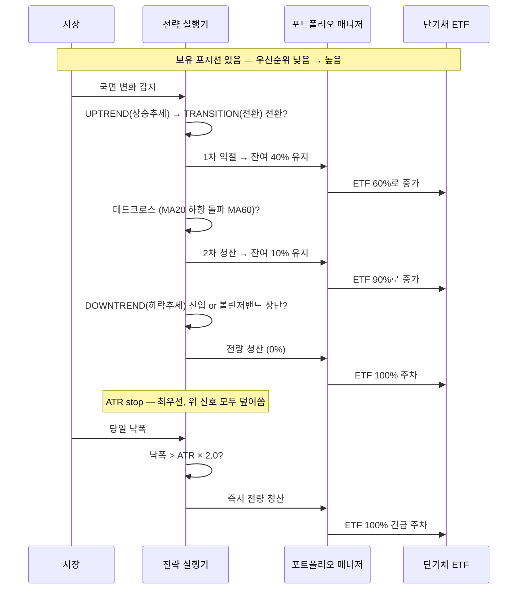

# 위험중립형 전략

> 관련: [[투자성향_분류]] | 확장: [[적극투자형_전략]]
> 매매원칙: [[매매원칙/분할매수매도_원칙]]
> 최적화: [[최적화/Walk_Forward_최적화]] · [[최적화/Grid_Search_최적화]]

## 성향 요약

"오를 때 충분히 벌고, 내릴 때 확실히 피한다"
- 하락장 회피(현금 대기) + 상승장 적극 매수
- MDD 최소화를 우선 목표로 설계
- 목표 수익: 연 CAGR 5~10%

---

## 전략 실행 흐름 — 시퀀스 다이어그램

### 매일 장 실행 흐름



### 매도 신호 우선순위 흐름



### Walk-Forward 최적화 주기

```mermaid
sequenceDiagram
    participant CAL as 3개월 캘린더
    participant OPT as 최적화 엔진
    participant PD  as 국면 판별기

    Note over CAL,PD: 3개월마다 실행 (연 4회)

    CAL->>OPT: 최적화 트리거
    OPT->>OPT: IS 12개월 학습 구간 설정
    Note over OPT: IS 12개월 고정 이유 — MA120이 신뢰도 있게 계산되려면\n학습 구간이 MA120(6개월)보다 충분히 길어야 함
    OPT->>OPT: 그리드 탐색\nadx_threshold [15·20·25·30]\nadx_sideways  [10·15·20]\n→ 12가지 조합
    OPT->>OPT: 평가 기준: Calmar Ratio
    OPT->>PD: 최적 adx_threshold 갱신
    OPT->>PD: 최적 adx_sideways 갱신
    PD->>PD: OOS 3개월 적용 시작
    Note over PD: atr_multiplier=2.0 고정\nATR 값 자체가 매일 변하므로 최적화 불필요
```

---

## 사용 지표와 이유

### MA20/60/120 · 이동평균 → [[TA지표/추세/MA_이동평균]]

**왜 3개인가?**
MA 하나만으로는 단기 노이즈와 진짜 추세를 구분하기 어렵다.
단기(20) · 중기(60) · 장기(120) 3개가 같은 방향으로 정렬됐을 때만 추세로 인정한다.

**왜 이 기간인가?**
- MA20: 약 1개월 — 단기 추세
- MA60: 약 3개월 — 중기 추세, 기관 기준선 역할
- MA120: 약 6개월 — 장기 추세
- 1:3:6 비율로 각 기간이 독립적인 추세 정보를 제공한다

### ADX · 추세강도 → [[TA지표/추세강도/ADX_추세강도]]

**왜 MA와 함께 쓰는가?**
MA 3중 정렬만으로는 횡보장에서도 정렬이 잠깐 발생할 수 있다.
ADX로 "지금이 진짜 추세인지"를 확인해 휩소를 걸러낸다.

**왜 threshold를 고정하지 않는가?**
업계 표준인 25를 초기값으로 쓰지만, 시장 환경에 따라 최적값이 달라진다.
낮은 threshold일수록 더 많은 추세를 포착하지만 휩소도 늘어난다.
3개월마다 재탐색해 시장 변화에 대응한다.
학습 구간(IS)은 12개월로 고정한다. MA120(6개월 이동평균)이 신뢰도 있게 계산되려면
IS 구간이 MA120보다 충분히 길어야 하므로 12개월 미만으로 줄이지 않는다.

```
탐색 범위: [15, 20, 25, 30]
최적화 기준: Sharpe Ratio
IS(학습) 구간: 12개월 고정
OOS(적용) 구간: 3개월 → 3개월마다 갱신
```

### 볼린저 밴드 → [[TA지표/변동성/볼린저밴드]]

**왜 횡보장에서만 쓰는가?**
볼린저 밴드는 평균 회귀 전략이다. 추세장에서 쓰면 추세를 역행하는 오신호가 발생한다.
ADX < adx_sideways로 횡보를 먼저 확인한 후에만 활성화한다.

### 국면 전환 첫날 진입 · MA20/MA60 교차 → [[TA지표/추세/MA_이동평균]]

**왜 골든크로스가 아닌 국면 전환 첫날인가?**
골든크로스(MA20이 MA60 상향 돌파)는 UPTREND 국면 판별 시점과 어긋난다.
UPTREND로 분류될 때는 이미 골든크로스가 지나간 경우가 대부분이므로
진입 기회가 극도로 제한된다.
국면 전환 첫날 진입으로 대체해 추세 초입 진입 의도를 유지하면서 기회를 확보한다.

### ATR · 평균 진폭 → [[TA지표/변동성/ATR_평균진폭]]

**왜 고정 비율 stop-loss(-7% 등)가 아닌가?**
종목마다 일간 변동폭(노이즈)이 다르다. 고정 비율은 변동성 높은 종목에서 오발동하고,
변동성 낮은 종목에서 미발동한다. ATR은 노이즈 크기에 자동으로 적응한다.

```
발동 조건: 당일 낙폭 < -(전일 ATR / 전일 종가 × 2.0)
결과: 즉시 전량 청산 (최우선 청산 신호)
```

**왜 Walk-Forward 최적화 대상이 아닌가?**
`atr_period=14`, `atr_multiplier=2.0`은 고정 파라미터지만, **ATR 값 자체가 매일 바뀐다.**
변동성이 낮은 구간에서는 ATR이 작아져 기준이 좁아지고,
급등락 구간에서는 ATR이 커져 기준이 자동으로 넓어진다.
파라미터를 최적화하지 않아도 시장 변동성이 기준을 조정해주는 구조다.

```
adx_threshold → Walk-Forward 최적화 대상 (추세 강도 기준)
atr_multiplier → 고정 (ATR 값이 매일 변하므로 최적화 불필요)
```

**ATR 적용 국면**
국면 판별 후 포지션이 있는 국면에서만 적용한다.

| 국면 | ATR 적용 | 이유 |
|------|---------|------|
| UPTREND | 적용 | MA는 후행 → 급락 인지까지 며칠 공백 존재 |
| SIDEWAYS | 적용 | 볼린저밴드 매수 후 진짜 하락 초입일 수 있음 |
| TRANSITION | 적용 | 기존 포지션 보유 중 → 보호 필요 |
| DOWNTREND | **스킵** | 포지션이 없으므로 불필요 |

### KOSPI MA120 시장 필터

**왜 개별 종목 신호만으로는 부족한가?**
2024년처럼 시장 전체가 하락할 때, 개별 종목은 진입 신호가 발생해도 곧바로 하락으로 전환된다.
보유 5개 종목(삼성전자·SK하이닉스·현대차·POSCO홀딩스·NAVER)은 모두 KOSPI 대형주로
시장 전체 방향과 상관도가 높으므로 KOSPI_MA120을 국면 판별 조건에 통합한다.

**왜 독립 레이어가 아닌 국면 조건에 통합하는가?**
별도 사전 필터로 두면 "KOSPI 필터는 기존 포지션 유지, DOWNTREND는 청산"이라는 신호 충돌이 발생한다.
국면 조건에 흡수하면 충돌 없이 단일 판별로 처리된다.

```
UPTREND  조건에 추가: AND  KOSPI > KOSPI.rolling(120).mean()
DOWNTREND 조건에 추가: OR   KOSPI < KOSPI.rolling(120).mean()
→ KOSPI 약세장이면 개별 종목 신호와 무관하게 DOWNTREND로 분류
```

**왜 MA120인가?**
MA120은 약 6개월 추세를 반영한다. 단기 조정(MA20/60)은 빈번해 과도한 차단이 발생하므로
장기 추세를 기준으로 시장 국면을 판별한다.

---

## 시장 국면 판별

4국면을 판별해 국면마다 다른 전략을 적용한다.
KOSPI_MA120 시장 필터는 독립 레이어 없이 국면 조건에 통합한다.

**판별 우선순위: SIDEWAYS → UPTREND → DOWNTREND → TRANSITION**

| 국면 | 조건 |
|------|------|
| SIDEWAYS | ADX < adx_sideways (Walk-Forward 최적화) |
| UPTREND | MA20 > MA60 > MA120 AND ADX > adx_threshold (Walk-Forward 최적화) **AND KOSPI > KOSPI_MA120** |
| DOWNTREND | MA20 < MA60 < MA120 AND ADX > adx_threshold (Walk-Forward 최적화) **OR KOSPI < KOSPI_MA120** |
| TRANSITION | 위 3가지 미해당 |

두 파라미터 모두 Walk-Forward로 3개월마다 재탐색한다.

```
adx_threshold 탐색 범위: [15, 20, 25, 30]   ← 추세 진입 강도
adx_sideways  탐색 범위: [10, 15, 20]        ← 횡보 판별 기준
조합 수: 4 × 3 = 12가지
IS(학습) 구간: 12개월 고정  ← MA120 신뢰도 확보
OOS(적용) 구간: 3개월       ← 연 4회 갱신
```

SIDEWAYS를 가장 먼저 판별하는 이유:
ADX가 낮은 구간에서 MA 정렬이 맞아도 추세가 아닌 노이즈일 수 있기 때문이다.

---

## 국면별 전략

### UPTREND
```
비UPTREND → UPTREND 전환 첫날 진입
→ 1차 매수 40%

60거래일 이내 종가 > MA20 지지 재확인 시
→ 2차 매수 70%
```
골든크로스는 UPTREND 국면 판별 시점과 어긋나 진입 기회를 극도로 제한한다.
국면 전환 첫날 진입으로 대체해 추세 초입 진입 의도를 유지한다.
2차 매수는 MA20 아래로 떨어진 후 회복이 아닌, 종가가 MA20 위에서 유지됨을 확인하는 것이다.

### SIDEWAYS
```
볼린저밴드 하단 터치 시 진입 → 30%
볼린저밴드 상단 터치 시 전량 청산
```

### DOWNTREND
```
신호 탐색 없이 전량 현금 대기
```
하락장에서 매수 신호를 찾으면 손실만 증가한다.
명확한 하락 추세에서는 "아무것도 안 하는 것"이 최선이다.

### TRANSITION
```
신규 진입 차단, 기존 포지션 유지
```
방향이 불명확한 구간에서 진입하면 휩소 가능성이 높으므로 대기한다.

---

## 분할 매수/매도 → [[매매원칙/분할매수매도_원칙]]

한 번에 전액 투자하면 타이밍 실수 시 손실이 크다.
단계적으로 진입·청산해 평균 단가를 개선하고 수익을 단계적으로 보호한다.

**분할 매수 3단계**

| 단계 | 조건 | 목표 비중 |
|------|------|----------|
| 1차 | UPTREND 전환 첫날 | 40% |
| 2차 | UPTREND + 종가 > MA20 지지 재확인 (60거래일 이내) | 70% |
| 횡보 | SIDEWAYS + 볼린저밴드 하단 (+ KOSPI > MA120) | 30% |

**분할 매도 4단계**

| 단계 | 조건 | 유지 비중 | 우선순위 |
|------|------|----------|---------|
| 1차 익절 | UPTREND → TRANSITION 전환 첫날 | 40% | 낮음 |
| 2차 청산 | 데드크로스 (MA20 < MA60 돌파) | 10% | 중간 |
| 횡보 청산 | SIDEWAYS + 볼린저밴드 상단 | 0% | 높음 |
| 추세 청산 | DOWNTREND 진입 | 0% | 높음 |
| **ATR stop** | **일일 낙폭 > ATR × 2.0** | **0%** | **최우선** |

**청산 우선순위 (낮음 → 높음):**
```
TRANSITION 전환 → 데드크로스 → BB 상단 · DOWNTREND → ATR stop-loss
```
ATR stop-loss는 size_series 마지막에 할당되어 모든 앞선 신호를 덮어쓴다.

---

## 멀티종목 포트폴리오

단일 종목 전략을 5개 섹터 대표 종목으로 확장하고, 유휴 현금은 단기채 ETF로 운용한다.

| 종목 | WICS 섹터 | 비고 |
|------|----------|------|
| 삼성전자 | IT (반도체) | 주식 전략 대상 |
| SK하이닉스 | IT (메모리) | 주식 전략 대상 |
| NAVER | 경기관련소비재 (인터넷) | 주식 전략 대상 |
| 현대차 | 경기관련소비재 (자동차) | 주식 전략 대상 |
| POSCO홀딩스 | 소재 (철강) | 주식 전략 대상 |
| **KODEX 단기채권 (153130.KS)** | **채권** | **현금 대체 — 자동 주차** |

**왜 균등 배분이 아닌 모멘텀 비례 배분인가?**
같은 국면이라도 종목마다 추세 강도가 다르다.
강한 종목에 더 많은 자본을 실어야 수익 효율이 높아진다.

```
최종 비중 = 신호 크기 × (종목 모멘텀 / 유효 종목 모멘텀 합)
```

**왜 국면마다 모멘텀 윈도우가 다른가?** → [[TA지표/모멘텀/모멘텀]]
추세 지속 기간이 국면마다 다르기 때문이다.

| 국면 | 윈도우 | 이유 |
|------|--------|------|
| UPTREND | 126일 | 추세가 길게 이어지므로 장기 모멘텀 신뢰도 높음 |
| TRANSITION | 63일 | 방향 불확실, 중기로 중간값 사용 |
| SIDEWAYS | 21일 | 단기 등락 반복, 빠른 반응 필요 |
| DOWNTREND | 사용 안 함 | 전량 청산 국면 |

---

## 현금 운용

DOWNTREND 및 현금 대기 구간에서 유휴 현금을 단기채 ETF에 자동 주차한다.

```
실전 ETF: KODEX 단기채권 ETF (153130.KS)
```

**왜 현금이 아닌 단기채 ETF인가?**
현금은 수익이 없다. 단기채 ETF는 일간 분배금이 자동 재투자되어
현금 대기 구간의 기회비용을 부분적으로 보전한다.

**구현 방식: 주식 비중의 역수를 ETF 비중으로 자동 할당**

별도의 ETF 매매 신호를 만들지 않는다.
주식 포지션이 결정된 후, 남은 현금 비중을 ETF에 자동으로 채운다.

```
ETF 비중 = 1 - 주식 투자 비중 합계

예시:
  DOWNTREND        → 주식 0%  → ETF 100% 매수
  UPTREND 1차 진입 → 주식 40% → ETF 60%로 축소
  UPTREND 2차 진입 → 주식 70% → ETF 30%로 추가 축소
  ATR stop-loss    → 주식 0%  → ETF 100% 재매수
```

**왜 ETF 신호를 별도로 만들지 않는가?**
vectorbt의 `targetpercent` 방식이 매일 목표 비중 차이만큼 자동으로 주문을 낸다.
주식 매수 시 ETF 자동 매도, 주식 청산 시 ETF 자동 매수가 같은 날 동시에 처리된다.

**소액 매매 방지**
주식 비중 합이 0.99일 때 ETF 비중 0.01을 매수하는 것은 비용 대비 비효율적이다.
`min_weight=0.01` 미만의 ETF 비중은 NaN(유지)으로 처리해 잦은 소액 매매를 차단한다.

**포트폴리오 변수 구분**

| 변수 | 내용 | 사용처 |
|------|------|--------|
| `NAMES` | 주식 5종목 | 기여도·분산·국면 분석 |
| `NAMES_ALL` | 주식 5종목 + 단기채 | 자산곡선·비중 히트맵·실행 |
| `close_df` | 주식 종가 DataFrame | 수익률·상관관계 계산 |
| `close_df_all` | 주식 + 단기채 종가 | 백테스트 실행 |

---

## 성과 평가 지표

목표: **KOSPI 대비 초과 성과 + MDD 최소화**

### 절대 지표

| 구분 | 지표 | 기준 | 의미 |
|------|------|------|------|
| 1차 관문 | **CAGR** | 5~10% | 미달 시 예금과 다를 바 없음 |
| 핵심 | **MDD** | -15% 이내 | 전략 존재 이유 |
| 핵심 | **MDD Duration** | 6개월 이내 | 실전 운용 가능성 |
| 효율 | **Calmar** | 0.5 이상 | 수익/MDD 비율 |
| 효율 | **Sortino** | 1.0 이상 | 하락 변동성 기준 효율 |

### KOSPI 상대 지표

멀티종목 포트폴리오는 KOSPI 지수를 벤치마크로 사용한다.
개별 종목 분석에는 단일 종목 B&H를 사용한다.

| 지표 | 기준 | 의미 |
|------|------|------|
| **Alpha** | ≥ 0 | KOSPI 대비 초과 수익 (핵심) |
| **Beta** | < 1.0 | 시장 민감도 낮을수록 하락 방어력 높음 |
| **MDD 감소율** | > 0% | 포트가 KOSPI보다 MDD가 작아야 함 |
| **Calmar 개선** | > 0 | KOSPI 대비 Calmar 비율 향상 |
| **Information Ratio** | > 0 | 초과 수익의 일관성 |

```
판단 흐름:
  Alpha < 0          → KOSPI 인덱스 펀드보다 못함 → 전략 실패
  Alpha ≥ 0 AND MDD감소율 > 0  → 1차 통과 → 절대 지표 확인
  절대 지표 통과      → Calmar/Sortino로 효율 확인
```

→ [[성과지표/CAGR]] · [[성과지표/MDD]] · [[성과지표/MDD_Duration]] · [[성과지표/Calmar비율]] · [[성과지표/Sortino비율]]

**Walk-Forward 최적화 metric:** `calmar_ratio`
