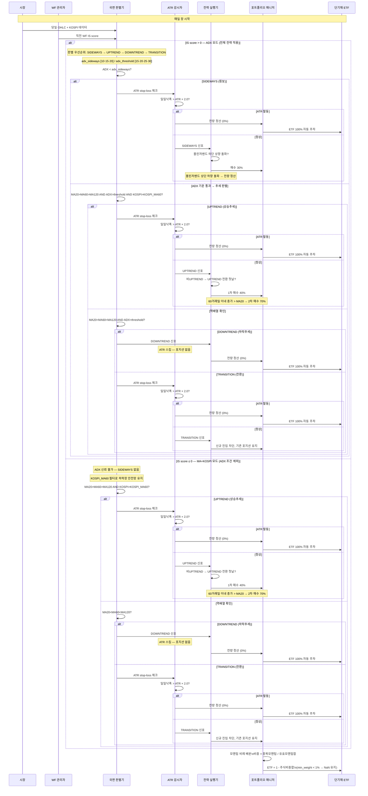
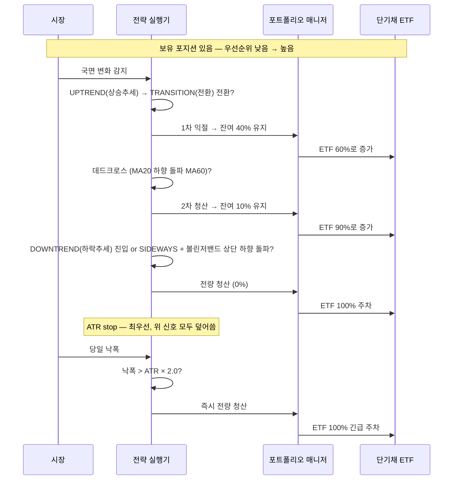

# 위험중립형 전략

> 관련: [[투자성향_분류]] | 확장: [[적극투자형_전략]]

---

## 성향 요약

"오를 때 충분히 벌고, 내릴 때 확실히 피한다"

- 하락장 회피(현금 대기) + 상승장 적극 매수
- MDD 최소화를 우선 목표로 설계
- 목표: 연 CAGR 6~10%, MDD -25% 이내

---

## 전략 실행 흐름 — 시퀀스 다이어그램

### 매일 장 실행 흐름



### Walk-Forward 최적화 주기

```mermaid
sequenceDiagram
    participant CAL as 3개월 캘린더
    participant OPT as 최적화 엔진
    participant PD  as 국면 판별기

    Note over CAL,PD: 3개월마다 실행 (연 4회)

    CAL->>OPT: 최적화 트리거
    OPT->>OPT: IS 12개월 학습 구간 설정
    Note over OPT: IS 12개월 고정 이유 — MA120이 신뢰도 있게 계산되려면\n학습 구간이 MA120(6개월)보다 충분히 길어야 함
    OPT->>OPT: 그리드 탐색\nadx_threshold [15·20·25·30]\nadx_sideways  [10·15·20]\n→ 12가지 조합
    OPT->>OPT: 평가 기준: Calmar Ratio → IS score 산출

    alt IS score > 0
        OPT->>PD: 최적 adx_threshold · adx_sideways 갱신
        PD->>PD: OOS 3개월 — ADX 모드 적용
    else IS score ≤ 0
        Note over OPT,PD: 어떤 파라미터도 IS에서 수익 미달\nADX 파라미터 신뢰 불가
        OPT->>PD: ADX 모드 비활성화
        PD->>PD: OOS 3개월 — MA+KOSPI 모드 적용\nKOSPI_MA60 필터로 하락장 UPTREND 차단 유지
    end

    Note over PD: atr_multiplier=2.0 고정\nATR 값 자체가 매일 변하므로 최적화 불필요
    Note over PD: KOSPI_MA60은 ADX·MA+KOSPI 양쪽 모드 모두 UPTREND 차단 전용
```

---

## 매도 신호 우선순위 흐름



---

## 성과 평가 지표

### 절대 지표

> 보유 종목(삼성전자·SK하이닉스·NAVER·현대차·POSCO홀딩스)의 2022년 실제 MDD가 -40~-65%임을 감안한 현실적 목표.
> MA 후행성으로 인해 DOWNTREND 판별 시점은 이미 10~20% 하락 후인 경우가 많다.

| 구분 | 지표 | 목표 | 경보선 |
|------|------|------|-------|
| 수익성 | **CAGR** | 6~10% | < 4% |
| 손실 방어 | **MDD** | -25% 이내 | > -35% |
| 손실 지속 | **MDD Duration** | 12개월 이내 | > 18개월 |
| 효율 | **Calmar** | 0.3 이상 | < 0.2 |
| 하락 효율 | **Sortino** | 0.5 이상 | < 0.3 |

```
목표 도달 예시:
  CAGR 8%, MDD -25% → Calmar = 0.32  ✓
  CAGR 6%, MDD -30% → Calmar = 0.20  ⚠ 경보
  CAGR 5%, MDD -35% → Calmar = 0.14  ✗ 실패
```

### KOSPI 상대 지표

| 지표 | 목표 | 경보선 |
|------|------|-------|
| **Alpha** | ≥ 2%p | < 0 |
| **Beta** | < 0.8 | > 1.0 |
| **MDD 감소율** | > 20% | < 10% |
| **Calmar 개선** | > 0.1 | < 0 |
| **Information Ratio** | > 0.3 | < 0 |
| **승률** | > 50% | < 40% |

### 해석

```
판단 흐름:
  Alpha < 0                     → KOSPI 인덱스 펀드보다 못함 → 전략 실패
  Alpha ≥ 2%p AND Beta < 0.8    → 1차 통과 → 절대 지표 확인
  MDD > -35% OR Duration > 18M  → 경보 → 전략 재검토
  절대 지표 통과                 → Calmar/Sortino로 효율 확인

실전 보정:
  백테스팅 CAGR에서 1~2%p 차감이 현실적
  이유: 증권거래세(0.20%) + 실전 슬리피지(0.1~0.3%) > 백테스팅 설정(0.1%)
```

→ [[성과지표/CAGR]] · [[성과지표/MDD]] · [[성과지표/MDD_Duration]] · [[성과지표/Calmar비율]] · [[성과지표/Sortino비율]] · [[성과지표/샤프비율]]

---

## 각 전략의 내용 및 링크

### 시장 국면 판별

IS score 결과에 따라 두 가지 모드로 분기한다.

#### ADX 모드 (IS score > 0)

판별 우선순위: SIDEWAYS → UPTREND → DOWNTREND → TRANSITION

| 국면 | 조건 | 전략 요약 |
|------|------|---------|
| **SIDEWAYS** | ADX < adx_sideways | 볼린저밴드 하단 상향 돌파 매수 30%, 상단 하향 돌파 전량 청산 |
| **UPTREND** | MA20 > MA60 > MA120 AND ADX > adx_threshold AND KOSPI > KOSPI_MA60 | 전환 첫날 1차 매수 40%, MA20 지지 재확인 후 2차 매수 70% |
| **DOWNTREND** | MA20 < MA60 < MA120 AND ADX > adx_threshold | 신호 탐색 없이 전량 현금 대기 |
| **TRANSITION** | 위 3가지 미해당 | 신규 진입 차단, 기존 포지션 유지 |

#### MA+KOSPI 모드 (IS score ≤ 0)

ADX 조건 제외. SIDEWAYS 없음. 판별 우선순위: UPTREND → DOWNTREND → TRANSITION

| 국면 | 조건 | 전략 요약 |
|------|------|---------|
| **UPTREND** | MA20 > MA60 > MA120 AND KOSPI > KOSPI_MA60 | ADX 모드와 동일 — 1차 40%, 2차 70% |
| **DOWNTREND** | MA20 < MA60 < MA120 | 신호 탐색 없이 전량 현금 대기 |
| **TRANSITION** | 위 2가지 미해당 | 신규 진입 차단, 기존 포지션 유지 |

```
모드 전환 이유:
  IS score ≤ 0 = 학습 구간에서 어떤 ADX 파라미터도 수익 미달
  → ADX 기반 신호를 신뢰할 수 없음
  → MA 정배열 + KOSPI_MA60(3개월 추세)으로 단순화
  → KOSPI_MA60 필터가 하락장 UPTREND 진입을 차단하는 안전망 역할 유지
```

→ [[TA지표/추세/MA_이동평균]] · [[TA지표/추세강도/ADX_추세강도]] · [[TA지표/변동성/볼린저밴드]]

### 분할 매수/매도

| 단계 | 조건 | 목표 비중 | 우선순위 |
|------|------|---------|---------|
| 1차 매수 | UPTREND 전환 첫날 | 40% | — |
| 2차 매수 | UPTREND + 종가 > MA20 (60거래일 이내) | 70% | — |
| 횡보 매수 | SIDEWAYS + 볼린저밴드 하단 상향 돌파 | 30% | — |
| 1차 익절 | UPTREND → TRANSITION 전환 | 40% 유지 | 낮음 |
| 2차 청산 | 데드크로스 (MA20 < MA60) | 10% 유지 | 중간 |
| 전량 청산 | DOWNTREND 진입 or SIDEWAYS + 볼린저밴드 상단 하향 돌파 | 0% | 높음 |
| **ATR stop** | **낙폭 > ATR × 2.0** | **0%** | **최우선** |

→ [[매매원칙/분할매수매도_원칙]]

### ATR Stop-Loss

```
발동 조건: 당일 낙폭 > -(전일 ATR / 전일 종가 × 2.0)
결과: 즉시 전량 청산 — 모든 앞선 신호를 덮어씀

atr_period     = 14  (고정)
atr_multiplier = 2.0 (고정 — ATR 값 자체가 매일 변하므로 최적화 불필요)

적용 국면: UPTREND · SIDEWAYS · TRANSITION (포지션 있는 국면)
스킵 국면: DOWNTREND (포지션 없음)
```

→ [[TA지표/변동성/ATR_평균진폭]]

### 모멘텀 비례 배분

균등 배분 대신 추세 강도에 비례해 자본을 배분한다.

```
최종 비중 = 신호 크기 × (종목 모멘텀 / 유효 종목 모멘텀 합)
```

| 국면 | 모멘텀 윈도우 | 이유 |
|------|-------------|------|
| UPTREND | 126일 | 추세가 길게 이어지므로 장기 신뢰도 높음 |
| TRANSITION | 63일 | 방향 불확실, 중기 중간값 사용 |
| SIDEWAYS | 21일 | 단기 등락 반복, 빠른 반응 필요 |
| DOWNTREND | 사용 안 함 | 전량 청산 국면 |

→ [[TA지표/모멘텀/모멘텀]]

### 현금 운용 — 단기채 ETF 자동 주차

```
ETF 비중 = 1 - 주식 투자 비중 합계

예시:
  DOWNTREND        → 주식 0%  → ETF 100%
  UPTREND 1차 진입 → 주식 40% → ETF 60%
  UPTREND 2차 진입 → 주식 70% → ETF 30%
  ATR stop-loss    → 주식 0%  → ETF 100%

소액 매매 차단: ETF 비중 변화 < 1% → NaN(유지) 처리
실전 ETF: KODEX 단기채권 (153130.KS)
```

### Walk-Forward 최적화

```
IS 12개월 학습 → OOS 3개월 적용 (연 4회 갱신)
평가 기준: Calmar Ratio → IS score 산출

IS score > 0  → best_params(ADX 기반) OOS 적용 — ADX 모드
IS score ≤ 0  → ADX 조건 제외, MA+KOSPI 모드로 OOS 운용
               안전망: KOSPI_MA60 필터 유지 → 하락장 UPTREND 진입 차단

탐색 파라미터:
  adx_threshold [15·20·25·30]
  adx_sideways  [10·15·20]
  → 12가지 조합

과적합 진단: OOS/IS Calmar 비율 ≥ 0.5 이상이어야 정상
```

→ [[최적화/Walk_Forward_최적화]] · [[최적화/Grid_Search_최적화]]
