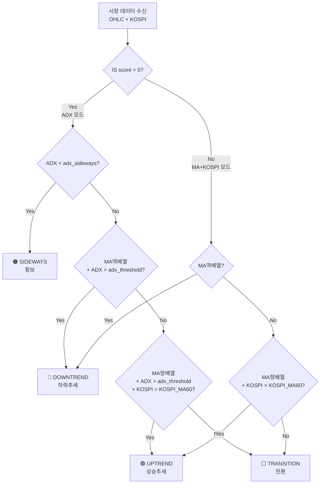
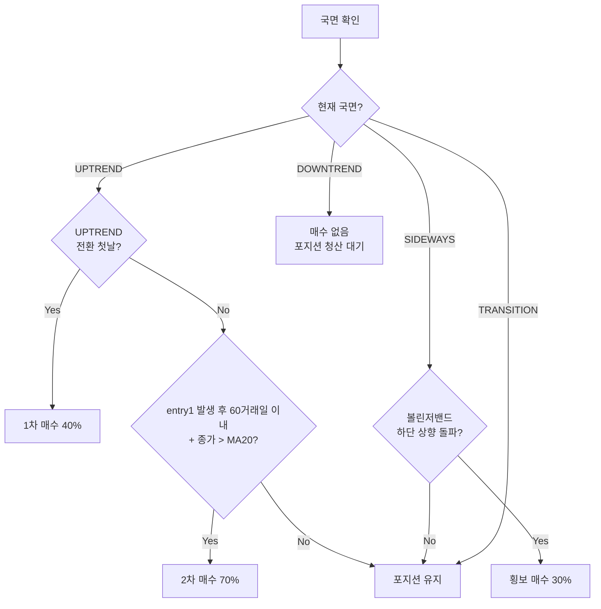
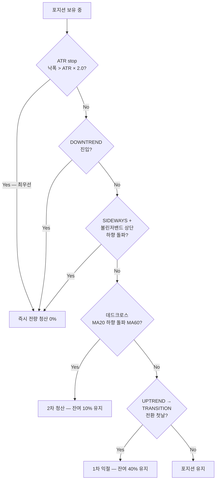
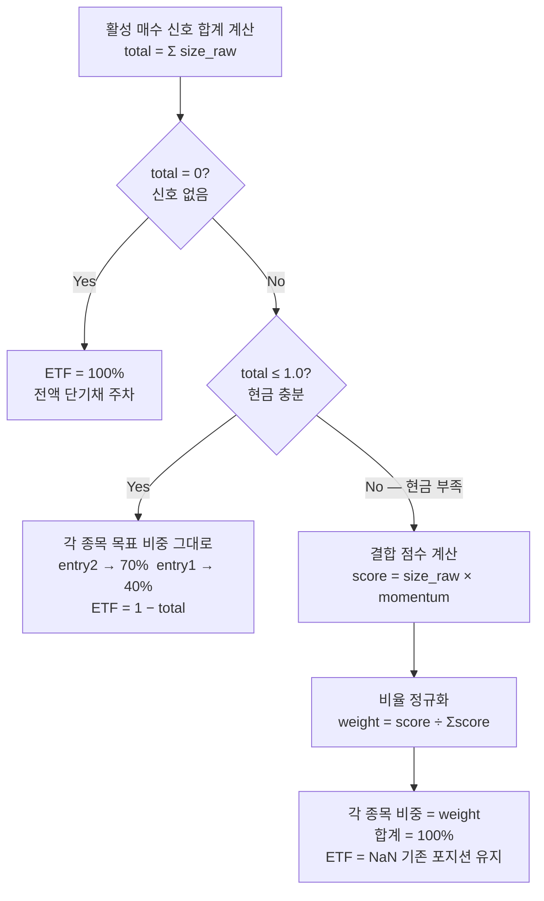

# 위험중립형 전략

> 관련: [[투자성향_분류]] | 확장: [[적극투자형_전략]]

---

## 성향 요약

"은행 예금보다는 더 벌되, 시장 하락은 확실히 피한다"

- **비교 기준선: 단기채 100% 보유** (기회비용 — 단기채보다 못하면 전략 가치 없음)
- 하락장 회피(현금 → 단기채 주차) + 상승장 선별 매수
- MDD 방어를 수익보다 우선시 (Beta ≤ 0.8 목표)
- 목표: CAGR 8%+, MDD -30% 이내 (경보: CAGR 5% / MDD -40%)

---

## 평가 기준

> 기준선: **단기채 100% 보유** (기회비용 — 예금보다 높아야 전략 가치 있음)
> 결과 테이블 열 순서: **전략 | 단기채 100% | KOSPI | 목표 | 경보선 | 상태**

| 지표 | 목표 | 경보선 | 비고 |
|------|------|-------|------|
| **[[성과지표/CAGR\|CAGR]]** | 8% | 5% | 경보 이하면 예금 수준 → 전략 가치 의심 |
| **[[성과지표/MDD\|MDD]]** | -30% | -40% | 위험중립형은 하락 방어가 핵심 |
| **[[성과지표/MDD_Duration\|MDD기간(월)]]** | 24 | 36 | 회복 기간이 길면 투자자 이탈 위험 |
| **[[성과지표/Calmar비율\|Calmar]]** | 0.35 | 0.20 | 수익/손실 효율 |
| **[[성과지표/Sortino비율\|Sortino]]** | 0.8 | 0.5 | 하방 변동성 대비 수익 |
| **[[성과지표/Alpha\|Alpha(vs KOSPI)]]** | +2% | 0% | 0% 이하면 인덱스 펀드보다 못함 |
| **[[성과지표/Beta\|Beta]]** | ≤0.8 | ≤1.0 | 시장 민감도 억제 |
| **[[성과지표/MDD감소율\|MDD감소율(vs KOSPI)]]** | 20% | 10% | KOSPI 대비 MDD 개선 정도 |
| **[[성과지표/Calmar개선\|Calmar개선(vs KOSPI)]]** | +0.1 | 0.0 | KOSPI 대비 효율 개선 |
| **[[성과지표/IR\|IR(vs KOSPI)]]** | 0.2 | 0.0 | 초과 수익의 일관성 |
| **[[성과지표/승률\|승률(월)]]** | 55% | 45% | 월별 수익 달성 빈도 |

---

## 전략 구조 개요

매일 장 마감 후 4단계를 순서대로 실행한다.

```
① 시장 국면 판별  →  ② 매수/매도 신호 생성  →  ③ 자금 배분  →  주문 실행
                                                         ↑
                              ④ Walk-Forward 최적화 (3개월마다 파라미터 갱신)
```

---

## 1. 시장 국면 판별

매일 ADX·MA·KOSPI 지표를 조합해 4가지 국면 중 하나로 분류한다.
국면이 이후 모든 매매 행동을 결정한다.

> **ADX 모드 / MA+KOSPI 모드 전환 기준**
> Walk-Forward IS 구간에서 종목별 Calmar Ratio를 산출한다.
> IS score > 0 이면 ADX 모드, ≤ 0 이면 ADX를 신뢰할 수 없으므로 MA+KOSPI 모드로 전환한다.

판별은 위에서 아래로 순서대로 확인하며, 먼저 해당되는 국면으로 확정한다.



### 국면별 조건 요약

| 국면 | ADX 모드 조건 | MA+KOSPI 모드 조건 |
|------|-------------|-----------------|
| **SIDEWAYS** | ADX < adx_sideways (기본 20) | 없음 |
| **UPTREND** | MA20>MA60>MA120 + ADX>threshold + KOSPI>MA60 | MA20>MA60>MA120 + KOSPI>MA60 |
| **DOWNTREND** | MA20<MA60<MA120 + ADX>threshold | MA20<MA60<MA120 |
| **TRANSITION** | 위 3가지 미해당 | 위 2가지 미해당 |

```
MA 정배열: MA20 > MA60 > MA120  (단기 > 중기 > 장기 — 상승 추세 구조)
MA 역배열: MA20 < MA60 < MA120  (단기 < 중기 < 장기 — 하락 추세 구조)

KOSPI_MA60 필터:
  KOSPI 지수가 60일 이동평균 아래이면 UPTREND 진입을 차단한다.
  이유: 개별 종목이 정배열이더라도 시장 전체가 하락 중이면
        추세가 단기 반등일 가능성이 높음 → 위험중립 관점에서 진입 보류

파라미터 (WF 최적화 대상):
  adx_threshold [15·20·25·30]  — 추세 확인 강도 기준
  adx_sideways  [10·15·20]     — 횡보 판별 기준
```

→ [[TA지표/추세/MA_이동평균]] · [[TA지표/추세강도/ADX_추세강도]]

---

## 2. 매수/매도 신호

국면이 확정된 후 세부 기술 조건을 추가로 확인해 신호를 생성한다.
**ATR stop은 모든 신호보다 우선한다.**

### 매수 신호



### 매도 신호 (우선순위 순)



### 신호 요약표

| 신호 | 조건 | 목표 비중 | 우선순위 |
|------|------|---------|---------|
| **ATR stop** | 낙폭 > ATR × 2.0 | 0% | **최우선** |
| 전량 청산 | DOWNTREND 진입 | 0% | 높음 |
| 볼린저 청산 | SIDEWAYS + BB 상단 하향 돌파 | 0% | 높음 |
| 2차 청산 | 데드크로스 (MA20 < MA60) | 10% 유지 | 중간 |
| 1차 익절 | UPTREND → TRANSITION 전환 첫날 | 40% 유지 | 낮음 |
| 1차 매수 | UPTREND 전환 첫날 | 40% | — |
| 2차 매수 | UPTREND + 종가 > MA20 (60거래일 이내) | 70% | — |
| 횡보 매수 | SIDEWAYS + BB 하단 상향 돌파 | 30% | — |

```
ATR stop 발동 조건:
  당일 낙폭 > -(전일 ATR / 전일 종가 × 2.0)
  atr_period     = 14  (고정)
  atr_multiplier = 2.0 (고정 — ATR 값 자체가 매일 변하므로 최적화 불필요)
  적용 국면: UPTREND · SIDEWAYS · TRANSITION (포지션 있는 국면)
  스킵 국면: DOWNTREND (포지션 없음)
```

→ [[TA지표/변동성/ATR_평균진폭]] · [[TA지표/변동성/볼린저밴드]] · [[TA지표/추세/MA_이동평균]] · [[매매원칙/분할매수매도_원칙]]

---

## 3. 자금 배분

같은 날 여러 종목에서 매수 신호가 발생했을 때 자금을 어떻게 나누는지 결정한다.
신호 합계가 100% 이하면 각자 원하는 만큼, 초과하면 신호강도와 모멘텀으로 전액 배분한다.



```
현금 부족 시 배분 예시:
  A (entry2=0.7, 모멘텀 60%) + B (entry1=0.4, 모멘텀 40%)  합계 = 1.1

  결합점수: A = 0.7 × 0.6 = 0.42  /  B = 0.4 × 0.4 = 0.16  /  합 = 0.58
  배분비율: A = 0.42 ÷ 0.58 = 72.4%  /  B = 0.16 ÷ 0.58 = 27.6%
  → A = 72.4%, B = 27.6%, ETF = NaN (기존 포지션 유지)

  해석: entry2인 A가 entry1인 B보다 신호가 강하고 모멘텀도 높으므로 더 많은 비중을 가져감.
        현금이 부족할 때도 강한 신호 종목이 우선된다.

ETF NaN 처리 근거:
  targetpercent 모드에서 NaN = "주문 없음 → 기존 포지션 유지"
  주식에 100% 투자 시 ETF를 강제 청산(0.0)하면 불필요한 매매 비용 발생.
  현금이 생기는 다음 사이클에서 자연스럽게 재주차된다.

add_cash_etf() 세부 동작 (stock_system/portfolio.py):
  invested    = size_df.ffill().fillna(0).clip(0,1).sum(axis=1)   ← 이전 포지션 ffill 반영
  cash_weight = (1 - invested).clip(0, 1)
  etf_size    = cash_weight.where(cash_weight >= 0.01, NaN)        ← 1% 미만은 NaN (소액 매매 방지)

  1% 미만 임계값(min_weight=0.01) 의도: 잔여 현금이 극소량(예: 0.5%)이면
  ETF 매수 주문을 생성하지 않아 불필요한 거래 비용과 수량 오류를 방지한다.
```

| 조건 | 주식 배분 | 단기채 ETF |
|------|----------|-----------|
| 신호 없음 | 0% | **1.0** 전액 주차 |
| 신호 합계 ≤ 100% | 각자 목표 비중 그대로 | **1 − 합계** 나머지 주차 |
| 신호 합계 > 100% | 신호강도 × 모멘텀으로 **100%** 배분 | **NaN** 기존 유지 |

```
모멘텀 윈도우 (국면별):
  UPTREND    126일 — 추세가 길게 이어지므로 장기 신뢰도 높음
  TRANSITION  63일 — 방향 불확실, 중기 중간값 사용
  SIDEWAYS    21일 — 단기 등락 반복, 빠른 반응 필요
  DOWNTREND       — 전량 청산 국면, 모멘텀 미사용
```

→ [[TA지표/모멘텀/모멘텀]]

---

## 4. Walk-Forward 최적화

3개월마다 종목별로 최적 ADX 파라미터를 자동 갱신한다.
고정 파라미터의 과적합 문제를 방지하고 시장 변화에 적응한다.

```mermaid
sequenceDiagram
    participant CAL as 3개월 캘린더
    participant OPT as 최적화 엔진
    participant PD  as 국면 판별기 (종목별)
    participant PM  as 포트폴리오 매니저

    Note over CAL,PM: 3개월마다 실행 (연 4회)

    CAL->>OPT: 최적화 트리거
    OPT->>OPT: IS 12개월 학습 구간 설정
    Note over OPT: IS 12개월 고정 이유\nMA120 신뢰도 확보에\n최소 6개월 이상 필요

    loop 종목별 독립 실행
        OPT->>OPT: 그리드 탐색\nadx_threshold [15·20·25·30]\nadx_sideways  [10·15·20]\n→ 12가지 조합
        OPT->>OPT: 평가: 종목 단독 Calmar Ratio\n→ 종목별 IS score 산출

        alt IS score > 0
            OPT->>PD: best_params 갱신\n(adx_threshold · adx_sideways)
            PD->>PD: OOS 3개월 — ADX 모드 적용
        else IS score ≤ 0
            Note over OPT,PD: 어떤 파라미터도 IS에서 수익 미달\nADX 신뢰 불가
            OPT->>PD: ADX 모드 비활성화
            PD->>PD: OOS 3개월 — MA+KOSPI 모드 적용
        end
    end

    Note over PM: 자금 배분은 포트폴리오 수준 유지\n종목 간 모멘텀 비교로 비중 결정
    PM->>PM: 신호 합계 확인 → 3단계 자금 배분 실행
```

```
용어 정리:
  IS (In-Sample)  : 파라미터를 학습하는 구간 (12개월)
  OOS (Out-of-Sample): 학습된 파라미터를 실전 적용하는 구간 (3개월)

설계 근거:
  종목별 독립 평가:
    삼성전자(고변동성)와 KB금융(저변동성)에 동일 ADX 파라미터를 쓰면
    한쪽은 신호 과다, 다른 쪽은 신호 부재 발생 → 종목별 최적값이 다름

  포트폴리오 수준 유지 항목:
    모멘텀 비례 배분은 종목 간 비교가 필요 → 포트폴리오 단위에서만 계산 가능

과적합 진단: OOS/IS Calmar 비율 ≥ 0.5 이상이어야 정상
```

→ [[최적화/Walk_Forward_최적화]] · [[최적화/Grid_Search_최적화]]

---

## 성과 평가 지표

> 위 **평가 기준** 섹션 참고. 여기서는 해석 흐름과 실전 보정만 기술한다.

### 판단 흐름

```
단기채 CAGR < 전략 CAGR?   No  → 예금보다 못함 → 전략 실패
                            Yes → KOSPI 대비 Alpha 확인

Alpha < 0                   → 인덱스 펀드보다 못함 → 전략 실패
Alpha ≥ +2% AND Beta ≤ 0.8  → 1차 통과 → 절대 지표 확인

MDD < -40% OR 기간 > 36M    → 경보 → 전략 재검토
절대 지표 통과               → Calmar/Sortino로 효율 확인
```

### 실전 보정

```
백테스팅 CAGR에서 1~2%p 차감이 현실적.
이유: 증권거래세(0.20%) + 실전 슬리피지(0.1~0.3%) > 백테스팅 설정(0.1%)

MA 후행성으로 DOWNTREND 판별 시점은 이미 10~20% 하락 후인 경우가 많다.
2022년 보유 종목 실제 MDD: 삼성전자·SK하이닉스·NAVER·현대차·KB금융 = -40~-65%
```

→ [[성과지표/CAGR]] · [[성과지표/MDD]] · [[성과지표/MDD_Duration]] · [[성과지표/Calmar비율]] · [[성과지표/Sortino비율]] · [[성과지표/샤프비율]]

---

## 구현 현황

| 항목 | 상태 | 구현 위치 |
|------|------|----------|
| MA 정배열·역배열 계산 | 종목별 ✅ | `strategies/regime.py` |
| ADX 계산 | 종목별 ✅ | `indicators/trend_strength/adx.py` |
| IS score (그리드 서치 평가) | 종목별 독립 산출 ✅ | `backtest/engine.py` — `_walk_forward_portfolio()` 내 `for name in names:` 루프 |
| `use_adx_mode` | 종목별 dict ✅ | `backtest/engine.py` — `per_stock_params[name]["use_adx_mode"]` |
| **자금 배분** (`build_size_df`) | 3단계 배분 ✅ | `stock_system/portfolio.py` |
| 모멘텀 비례 배분 | 포트폴리오 전체 ✅ | `stock_system/portfolio.py` — 의도적 유지 |
| `get_signal()` 종목별 모드 | 종목별 dict 수신 ✅ | `profiles/neutral.py` |
| 단기채 ETF 주차 | ✅ | `stock_system/portfolio.py` — `add_cash_etf()` |

### 파일 구조 (현재)

```
stock_system/
├── portfolio.py              ← build_size_df() + add_cash_etf()  (backtest·trading 공유)
├── backtest/
│   ├── engine.py             ← run_walk_forward(), run_bh_portfolio()
│   │                            _walk_forward_portfolio() — 종목별 독립 그리드 서치
│   ├── adapter.py            ← extract(pf) — vbt.Portfolio → pandas 변환
│   ├── metrics.py            ← calc_metrics(), build_metrics_table()
│   └── plots/
│       ├── performance.py
│       ├── strategy.py
│       └── optimizer.py
├── profiles/
│   └── neutral.py            ← make_signals(), get_signal()
│                                get_signal(): use_adx_mode = dict{종목명: bool} 수신 가능
└── strategies/
    └── regime.py             ← calc_regime() — 4국면 판별
```

```
종목별 독립 그리드 서치 흐름 (engine.py):

for name in names:
    best_score_s = -inf
    for combo in combos:                     # adx_threshold × adx_sideways 12가지
        pf_s  = 종목 단독 백테스트
        score = calmar_ratio(pf_s.value())   # 종목 단독 IS score

    per_stock_params[name] = {
        "best_params":  {adx_threshold, adx_sideways},
        "use_adx_mode": score > 0,           # True → ADX모드 / False → MA+KOSPI모드
        "best_score":   score,
    }
```
