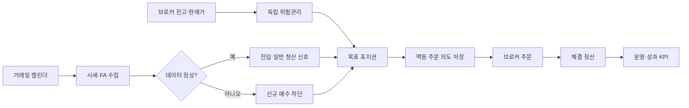

# 자동 주식매매 시스템 설계 기준

## 결론

이 시스템은 `데이터 → 신호 → 포트폴리오 → 위험관리 → 주문 → 정산 → 관측`을
분리한다. 보유 포지션의 가격 기반 손절은 데이터·FA·시장국면 장애보다 먼저
평가하며, 장애가 나면 신규 매수는 닫고 위험청산은 계속 허용한다. 실계좌 전환은
프로그램이 자동으로 수행하지 않는다.

한국투자증권 공식 예시는 REST 주문/조회와 WebSocket 실시간 시세를 분리하며,
모의투자 API의 호출 제한이 더 낮을 수 있음을 명시한다.
[KIS 공식 예제](https://github.com/koreainvestment/open-trading-api)

## 안전 불변식

1. 일봉·FA·시장국면이 없으면 신규 매수는 0건이다.
2. 보유 포지션의 실시간 가격 기반 손절·트레일링 스톱은 계속 평가한다.
3. 주문 전 DB 멱등성 선점에 실패하면 브로커 주문을 보내지 않는다.
4. 주문 응답이 불명확하면 체결로 간주하지 않고 정산 대기 상태로 둔다.
5. 포지션·주문·체결은 전략, 실행환경, 마스킹 계좌, 거래일 범위로 집계한다.
6. `NORMAL`은 데이터 신선도와 위험점검이 모두 충족될 때만 표시한다.
7. REAL 승격은 정량 게이트 통과 후에도 사람의 명시적 승인이 필요하다.
8. 당일 자산손실이 기본 3%에 도달하거나 수동 킬스위치가 켜지면 신규 매수와
   비중 확대만 차단하고 매도·손절은 계속 허용한다.
9. PAPER/REAL 성과는 전략·실행환경·마스킹 계좌가 포함된 append-only 계좌
   스냅샷과 명시적으로 인증한 기준선에서만 계산한다.
10. 기준선·KOSPI·외부 현금흐름 장부·주문/체결 비용 중 하나라도 검증되지 않으면
    REAL 승격용 성과 상태는 `BLOCKED`다.

## 실행 흐름

## 상태 우선순위

`ORDER_RECONCILIATION` → `DEGRADED_RISK_UNCHECKED` → `ENTRY_CIRCUIT_BREAKER` →
`DEGRADED_DATA_STALE` → `DEGRADED_DEPENDENCY` → `ERROR` → `NORMAL` 순으로
표시한다. 심각한 상태가 정상 상태에 의해 덮이지 않아야 한다.

## 핵심 KPI와 가드레일

| 구분 | 지표 | 정의 | 임시 목표 |
|---|---|---|---|
| 결과 KPI | 비용 차감 벤치마크 초과수익 | 전략 순수익률 - 동일 기간 벤치마크 | REAL 전환 시 0 초과 |
| 결과 KPI | 최대 낙폭 | 고점 대비 최저 누적 손실 | 60일 PAPER에서 -15% 이상 |
| 운영 KPI | 운영 무결성 | 신선도·위험점검·주문정산률의 최솟값 | 99.5% 이상 |
| 드라이버 | 데이터 신선도 | 정상 데이터 스캔 / 전체 스캔 | 99.5% 이상 |
| 드라이버 | 위험점검 커버리지 | 가격·평균단가 확인 보유건 / 전체 보유건 | 100% |
| 드라이버 | 주문 정산률 | 최종상태 주문 / 제출 주문 | 100% |
| 가드레일 | 치명 운영사고 | 위험점검 누락·중복주문·미해결 장애 | 0건 |
| 가드레일 | 비용 드래그 | 수수료+세금+슬리피지 / 시작자산 | 60일 1.5% 이하 |

목표치는 현재 107거래일 연구 리플레이의 약 2% 비용 드래그와 보수적 운영
기준을 바탕으로 둔 임시값이다. PAPER 표본이 쌓이면 거래 빈도와 시장 충격에
맞춰 다시 보정해야 한다.

## 승격 게이트

- `DRY_RUN → PAPER`: 최소 1거래일과 해당 거래일의 FINAL EOD 보고서, 스캔 존재, 데이터 신선도 99.5% 이상,
  위험점검·주문정산 100%, 치명 사고 0건.
- `PAPER → REAL`: 최소 60거래일과 10건 이상의 주문 생명주기 표본, 위 운영
  조건 전부, 비용 차감 초과수익 양수, 최대 낙폭 -15% 이내, 비용 드래그 1.5%
  이하.
- 게이트 구현: `core.analytics.trading_kpis.evaluate_promotion_gate`.
- EOD 산출물 구현: `core.analytics.trading_performance`. 거래일 15:30에 모드별
  JSON/Markdown 보고서와 PAPER의 `reports/promotion/real_readiness.json`을 갱신한다.
- 게이트 결과의 `ready=True`는 준비 상태일 뿐이며
  `manual_approval_required=True`는 항상 유지된다.

## 배포 순서

1. 전체 테스트와 2026-07-17 캘린더 회귀 테스트를 통과한다.
2. DB에 `08_order_execution_scope.sql`을 적용한다.
3. DRY_RUN을 재시작하고 후보/실제 주문, 데이터 상태, 위험청산 후보를 확인한다.
4. 1거래일 FINAL EOD 보고서 통과 후 PAPER 승격 여부를 검토하고, 다음 KRX
   거래일 장 시작 전에 `run_trader.bat` 메뉴 7로
   주문 없는 PAPER 계좌 기준선을 인증한다.
5. PAPER 60거래일 데이터를 동일 정의로 검증한다.
6. REAL은 사용자가 별도로 승인하고 최소 자본·최소 비중부터 단계적으로 연다.

## 아직 자동화하지 않는 결정

- 손절 폭, 종목당 최대비중, 전체 익스포저 변경
- 전략 교체와 파라미터 재최적화
- 장애 중 강제청산 여부
- PAPER/REAL 실행 모드 전환

이 결정들은 과최적화·데이터 오류·의도하지 않은 자본 노출 위험 때문에 검토와
명시적 승인을 거친다.

## 주문결과 원장 무결성과 패리티

- 매 거래 사이클은 당일 `FILLED` 주문의 `filled_qty`와 `executions.qty` 합계를 계좌·전략·실행환경 범위로 비교한다.
- 연결 누락이나 수량 불일치가 있으면 `EXECUTION_LEDGER_INCOMPLETE`로 신규 매수만 차단한다. 기존 보유 종목의 손절·트레일링 등 위험청산은 계속 허용한다.
- `apps.backtester.paper_order_result_replay`는 관측된 체결수량과 체결가격만 시간순으로 재생한다.
- 패리티를 맞추기 위해 필요한 시작 현금·수량은 `opening balancing entries`로 분리하며 거래로 위조하지 않는다.
- 가격 커버리지 100%와 5억원 무조정 패리티가 모두 확인되기 전에는 전략 후보를 운영 규칙으로 승격하지 않는다.
- 전체 완료 상태는 `docs/AUTOMATED_TRADING_COMPLETION_MATRIX.md`의 직접 증거와 완료 조건으로 감사한다.
