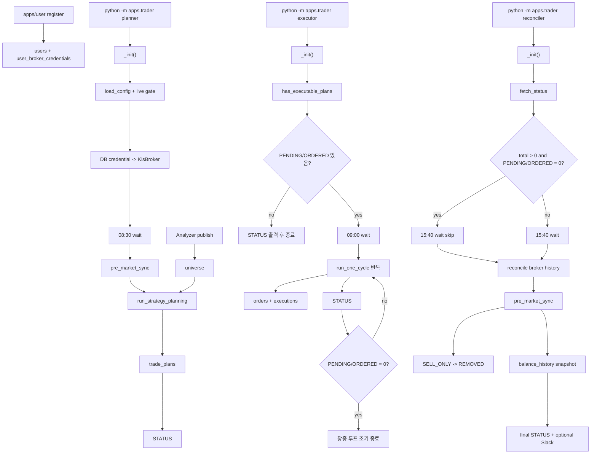

# daily runtime 전체흐름

근거 코드: `apps/trader/__main__.py`, `apps/trader/scheduler.py`

## 핵심 연결

| 연결 | 의미 |
|---|---|
| `apps/user register -> _init` | Trader는 DB 자격증명으로 KIS broker를 만든다. |
| `Analyzer publish -> planner` | Trader의 운영 후보는 `universe`다. |
| `planner -> executor` | 장전 `trade_plans`가 장중 실행 입력이다. |
| `executor -> reconciler` | 장중 주문/체결은 장마감 broker history로 다시 맞춘다. |
| `reconciler -> next executor` | `balance_history`가 다음 거래일 손실 한도 기준이다. |
