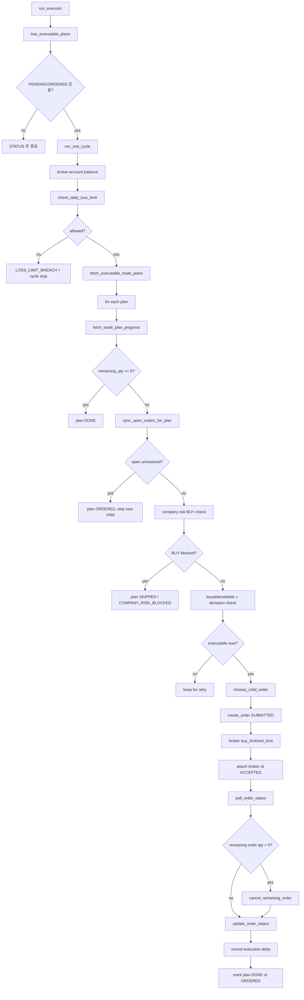

# executor 주문실행 상세

근거 코드: `apps/trader/runner.py`, `core/trade/execution.py`

## 재시도 설계

| 상황 | 결과 |
|---|---|
| 호가 편차 초과 | plan을 닫지 않고 다음 사이클에서 다시 확인 |
| 매수/매도 가능수량 0 | plan을 닫지 않고 다음 사이클에서 다시 확인 |
| 열린 주문 미확정 | `ORDERED` 유지 |
| 일부 체결 후 잔량 | `ORDERED` 유지 |
| 기업 위험 BUY 차단 | `SKIPPED`으로 닫음 |

## 기록 테이블

| 단계 | 테이블 |
|---|---|
| 계획 상태 | `trade_plans` |
| 주문 생성/상태 | `orders` |
| 상태 이력 | `order_status_history` |
| 체결 delta | `executions` |
