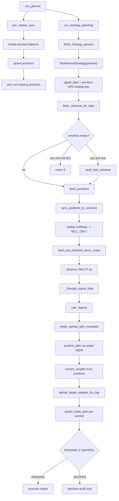

# planner 계획생성 상세

근거 코드: `apps/trader/planner.py`, `core/trade/position_sync.py`, `storage/postgres/repositories/universe_repo.py`

## 상태 생성 기준

| 상태 | 생성 조건 |
|---|---|
| `PENDING` | 목표 비중 차이로 최소 1주 이상 주문 가능 |
| `SKIPPED` | 신호 없음, 가격 없음, 최소 수량 미달, SELL_ONLY BUY 차단 |

## 저장 포인트

| 저장소 | 저장 내용 |
|---|---|
| `positions` | KIS 잔고 기준 보유 수량/평균단가 |
| `universe` | 보유 중이지만 후보 밖인 종목 SELL_ONLY 등록 |
| `trade_plans` | 오늘의 주문/미주문 의사결정 |
