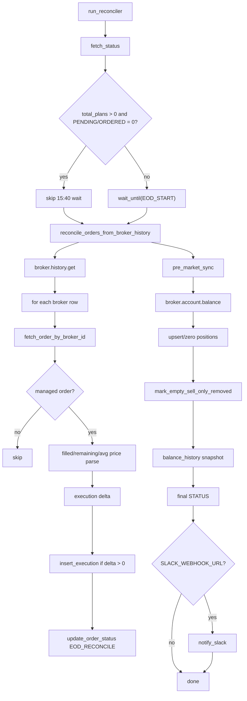

# reconciler 정산 상세

근거 코드: `apps/trader/__main__.py`, `core/trade/reconcile.py`, `core/trade/position_sync.py`

## 정산 산출물

| 산출물 | 의미 |
|---|---|
| `orders` 갱신 | 브로커 이력 기준 주문 상태 보정 |
| `executions` 추가 | 아직 저장되지 않은 체결 delta 저장 |
| `positions` 갱신 | 장마감 실제 보유 상태 |
| `universe REMOVED` | SELL_ONLY 청산 완료 반영 |
| `balance_history` | 다음 거래일 손실 한도 기준 |
