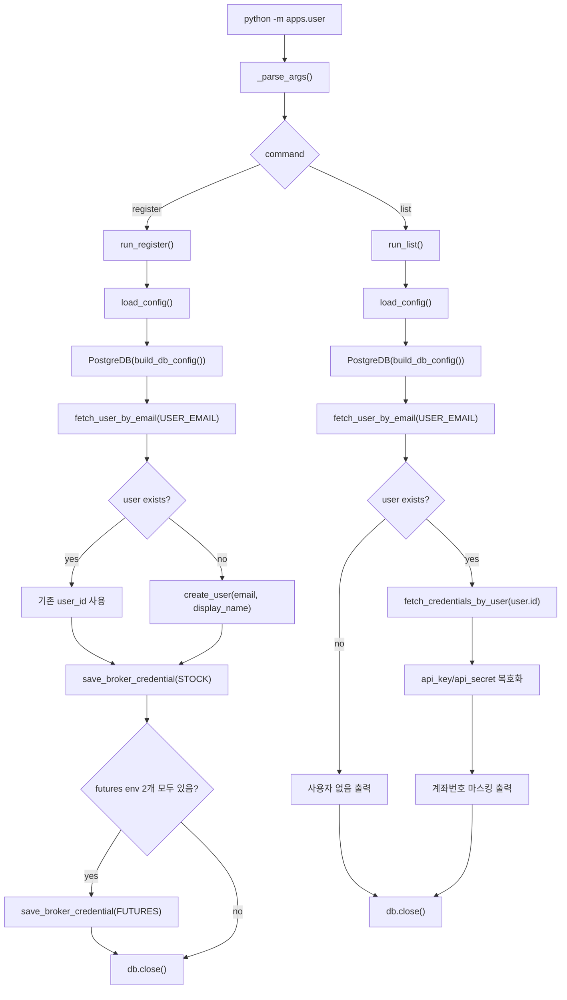

# register/list 흐름

근거 코드: `apps/user/__main__.py`, `apps/user/config.py`, `storage/postgres/repositories/*_repo.py`

## 핵심 분기

| 분기 | 의미 |
|---|---|
| `register` | 사용자가 없으면 만들고, 계좌 자격증명을 저장 또는 갱신한다. |
| `list` | 등록된 사용자와 자격증명을 조회해 마스킹된 계좌 정보만 출력한다. |
| 선물 계좌 env | 계좌번호와 상품코드가 모두 있을 때만 `FUTURES` 자격증명을 저장한다. |

## 구현상 특징

- `register`와 `list` 모두 동일한 `load_config()`를 사용한다.
- 자격증명 저장/조회 모두 `CREDENTIAL_ENCRYPTION_KEY`가 필요하다.
- `list`는 복호화된 dict를 받지만 API 키/시크릿은 출력하지 않는다.
