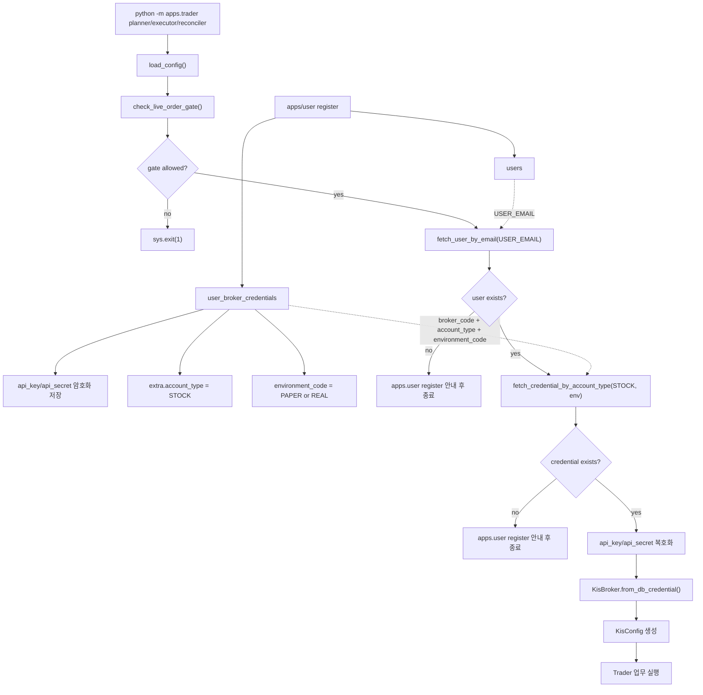

# Trader 자격증명 연결흐름

근거 코드: `apps/trader/__main__.py`, `apps/trader/config.py`, `storage/postgres/repositories/credential_repo.py`, `core/trade/kis_broker.py`



## Trader가 기대하는 저장 상태

| 조건 | 코드 기준 |
|---|---|
| 사용자 존재 | `fetch_user_by_email(db, cfg.user_email)` |
| 활성 STOCK 자격증명 존재 | `fetch_credential_by_account_type(..., account_type="STOCK")` |
| 증권사 일치 | `broker_code=cfg.broker_code` |
| 거래 환경 일치 | `environment_code=cfg.environment_code` |
| 복호화 가능 | `CREDENTIAL_ENCRYPTION_KEY`가 저장 시점과 동일 |

## 실패 시 안내

Trader는 사용자 또는 주식 계좌 자격증명을 찾지 못하면 다음 명령을 먼저 실행하라고 안내한다.

```bash
python -m apps.user register
```

이 안내는 단순 친절 메시지가 아니라 실제 dependency다. Trader는 `.env`에서 API 키/시크릿을 직접 읽지 않고 DB 자격증명을 사용한다.
