# analyze all 전체흐름

이 문서는 전체 단계의 큰 흐름이다. 함수 내부 분기와 저장 테이블까지 보려면 아래 상세 다이어그램을 같이 본다.

- [[00_다이어그램_지도|다이어그램 지도]]
- [[run_lifecycle_상세|run lifecycle 상세]]
- [[macro_관계분석_상세|macro 관계분석 상세]]
- [[sector_점수선정_상세|sector 점수선정 상세]]
- [[company_FA_기업선정_상세|company FA 기업선정 상세]]
- [[validation_publish_audit_상세|validation publish audit 상세]]
- [[storage_lineage_상세|storage lineage 상세]]

```mermaid
flowchart TB
    subgraph CLI["1. 실행 명령"]
        A["월간 분석 명령 실행<br/>코드: python -m apps.worker analyze all"] --> B["CLI 옵션을 내부 요청으로 변환<br/>코드: run_analyze(args)"]
        B --> C["분석월/마감일/적용일 정리<br/>코드: build_request<br/>주석: cutoff=데이터 마감일, effective=Trader 적용일"]
        C --> D["분석 파이프라인 시작<br/>코드: pipeline.run"]
    end

    subgraph PREP["2. 분석 준비"]
        D --> E["원천 데이터 준비도 확인<br/>코드: validate_source_readiness<br/>주석: Collector 데이터가 부족하면 분석 run을 만들지 않음"]
        E --> F["활성 전략 확인<br/>코드: fetch_active_strategy<br/>주석: 어떤 전략의 후보군으로 발행할지 결정"]
        F --> G["오래 멈춘 실행 정리<br/>코드: fail_stale_analysis_runs<br/>주석: 1시간 이상 RUNNING이면 FAIL 처리"]
        G --> H["같은 입력이면 기존 결과 재사용<br/>코드: get_or_create_analysis_run, input_hash"]
    end

    subgraph QUARTER["3. 기업 분기 재무 품질"]
        H --> I["분기 재무 점수 갱신<br/>코드: refresh_quarterly_scores<br/>주석: DART 재무제표를 기업 품질 점수로 변환"]
        I --> J[("기업 분기 FA 원장<br/>테이블: company_quarter_fa")]
    end

    subgraph MACRO["4. 매크로 환경 판단"]
        J --> K["매크로 분석<br/>코드: run_macro_analysis"]
        K --> L["매크로 방향<br/>코드: UP/DOWN/FLAT<br/>주석: 상승/하락/중립 압력"]
        L --> M["업종 민감도 계산<br/>코드: macro-industry relationships<br/>주석: 어떤 업종이 이 매크로에 유리했는지"]
        M --> N[("매크로 분석 결과<br/>테이블: fa_macro_results")]
    end

    subgraph SECTOR["5. 업종 후보 선정"]
        N --> O["업종 분석<br/>코드: run_sector_analysis"]
        O --> P["업종 점수 계산<br/>코드: score_and_select_sectors<br/>주석: 매크로 적합도 + 업종 내 재무 폭 + 유동성 - 리스크"]
        P --> Q[("업종 결과<br/>테이블: fa_sector_results")]
    end

    subgraph COMPANY["6. 종목 후보 선정"]
        Q --> R["기업 선정<br/>코드: run_company_selection"]
        R --> S["업종별 상위 2개 선택<br/>코드: select_companies<br/>주석: KOSPI 대형주, 재무점수, 신뢰도, 유동성, 위험상태 필터"]
        S --> T[("기업 결과<br/>테이블: fa_company_results")]
    end

    subgraph VALIDATE["7. 결과 검증"]
        T --> U["결과 계약 검증<br/>코드: validate_run<br/>주석: cutoff 이후 데이터 사용, 후보 수 제한, 매수 차단 확인"]
        U --> V["실행 상태 저장<br/>테이블: fa_analysis_runs<br/>상태: PASS/WARNING/FAIL"]
    end

    subgraph PUBLISH["8. 운영 후보군 발행"]
        V --> W{"운영 반영 요청인가?<br/>코드: --publish<br/>조건: PASS 또는 WARNING"}
        W -->|예| X["운영 후보군 발행<br/>코드: publish_universe"]
        X --> Y["원자적 DB 반영<br/>코드: publish_fa_run transaction<br/>주석: 실패하면 기존 후보군 유지"]
        Y --> Z[("Trader가 읽는 후보군<br/>테이블: universe<br/>ACTIVE=매수 가능, SELL_ONLY=청산 전용")]
        W -->|아니오| Z2["분석 결과만 저장<br/>주석: 실제 매매 후보군은 바뀌지 않음"]
    end
```

구현상 핵심:

- readiness FAIL은 run 생성 전 차단된다.
- `--publish`가 없으면 Trader 입력인 `universe`는 바뀌지 않는다.
- cache hit run도 `--publish`가 있으면 발행 경로를 탈 수 있다.
- Trader가 읽는 운영 계약은 `fa_company_results -> universe`이다.
