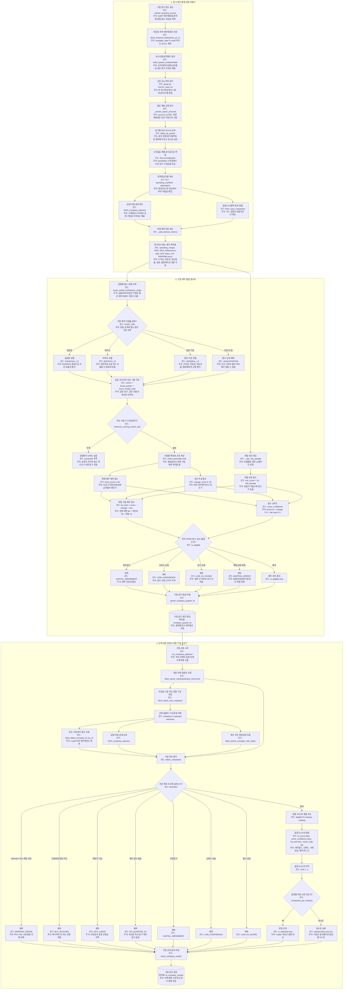

# company FA 기업선정 상세

근거 코드: `apps/worker/analyzer/company_job.py`

```mermaid
flowchart TB
    subgraph QFA["1. 분기 재무 품질 원장 만들기"]
        A["기업 분기 점수 갱신<br/>코드: refresh_quarterly_scores<br/>주석: DART 재무제표를 종목별 품질 점수 재료로 변환"] --> B["마감일 이전 재무제표만 조회<br/>코드: fetch_financial_statements_as_of<br/>주석: available_date가 cutoff 이후인 공시는 제외"]
        B --> C["보고서별 재무항목 정리<br/>코드: build_quarter_fundamentals<br/>주석: 손익/재무상태/현금흐름을 같은 분기 단위로 맞춤"]
        C --> D["같은 공시끼리 묶기<br/>코드: group by source_rcept_no<br/>주석: 한 접수번호에서 나온 BS/IS/CF를 합침"]
        D --> E["필요 계정 금액 찾기<br/>코드: _extract_report_amounts<br/>주석: account_id 우선, 한글 계정명은 보조 키워드로 사용"]
        E --> F["분기별 최신 보고서 선택<br/>코드: latest_by_period<br/>주석: 같은 종목/분기/재무제표 종류에서 최신 공시만 남김"]
        F --> G["누적값을 개별 분기값으로 변환<br/>코드: flow normalization<br/>주석: Q2/Q3/Q4 누적값에서 이전 분기 누적값을 차감"]
        G --> H["잉여현금흐름 계산<br/>코드: fcf = operating_cashflow - abs(capex)<br/>주석: 영업으로 번 현금에서 투자 지출을 뺀 값"]
        H --> I["상장/거래 상태 확인<br/>코드: fetch_company_statuses<br/>주석: 거래정지나 비정상 상태 기업을 가려내는 재료"]
        H --> J["업종/시가총액 정보 결합<br/>코드: fetch_wics_companies<br/>주석: 어느 업종의 대형주인지 확인"]
        I --> K["파생 재무지표 계산<br/>코드: _add_derived_metrics"]
        J --> K
        K --> L["투자자가 읽는 재무 체력표<br/>코드: operating_margin, ROE, ROA, debt/current ratio, OCF ratios, YoY, PER/PBR proxy<br/>주석: 수익성, 안정성, 현금창출, 성장, 밸류에이션 대용 지표"]
    end

    subgraph SCORE["2. 기업 재무 품질 점수화"]
        L --> M["업종별 점수 모델 선택<br/>코드: score_model_for(industry_code)<br/>주석: 금융/바이오/일반 기업은 좋은 재무지표의 기준이 다름"]
        M --> M1{"어떤 재무 모델을 쓸까?<br/>코드: model_code<br/>주석: 업종 성격에 맞는 평가 기준 선택"}
        M1 -->|금융업| N1["금융업 모델<br/>코드: FINANCIAL_V1<br/>주석: ROE/ROA 중심으로 자본 효율성 평가"]
        M1 -->|바이오| N2["바이오 모델<br/>코드: BIOTECH_V1<br/>주석: 생존력과 손실 축소 흐름을 더 중요하게 봄"]
        M1 -->|일반 기업| N3["일반 기업 모델<br/>코드: GENERAL_V1<br/>주석: 수익성, 안정성, 현금흐름, 밸류에이션 균형 평가"]
        M1 -->|지원 안 됨| N4["점수 산정 제외<br/>코드: UNSUPPORTED<br/>주석: 비교 기준이 없어 후보에서 밀릴 수 있음"]
        N1 --> O["같은 조건끼리 비교 그룹 구성<br/>코드: cohort = fiscal_quarter + score_model_code<br/>주석: 같은 분기, 같은 모델 안에서만 순위화"]
        N2 --> O
        N3 --> O
        N4 --> O
        O --> P{"비교 기업 수가 충분한가?<br/>코드: minimum_scoring_cohort_size"}
        P -->|부족| P0["상대평가 신뢰도 낮음<br/>코드: percentile 부족<br/>주석: 표본이 적으면 점수 확신도가 내려갈 수 있음"]
        P -->|충분| Q["지표별 백분위 순위 계산<br/>코드: metric percentile rank<br/>주석: 절대값보다 동종 기업 대비 위치를 봄"]
        Q --> R["현재 재무 체력 점수<br/>코드: level_score 0..60<br/>주석: 지금 수익성/안정성/현금흐름이 좋은가"]
        Q --> S["개선 추세 점수<br/>코드: change_score 0..30<br/>주석: 전년 대비 좋아지고 있는가"]
        L --> T["위험 차감 계산<br/>코드: _calc_risk_penalty<br/>주석: 모델별로 최대 10점까지 감점"]
        T --> U["위험 보정 점수<br/>코드: risk_score = 10 - risk_penalty<br/>주석: 위험이 적을수록 점수가 높음"]
        R --> V["최종 기업 재무 점수<br/>코드: fa_score = level + change + risk<br/>주석: 현재 체력 60 + 개선세 30 + 위험 10"]
        S --> V
        U --> V
        R --> W["점수 신뢰도<br/>코드: score_confidence<br/>주석: level 0.6 + change 0.3 + risk input 0.1"]
        S --> W
        U --> W
        V --> X{"투자 후보로 쓸 수 있는 품질인가?<br/>코드: is_eligible"}
        W --> X
        X -->|자본잠식| X1["제외<br/>코드: CAPITAL_IMPAIRMENT<br/>주석: 재무 안전성 훼손"]
        X -->|신뢰도 낮음| X2["제외<br/>코드: LOW_CONFIDENCE<br/>주석: 점수 산정 근거가 부족"]
        X -->|점수 낮음| X3["제외<br/>코드: LOW_FA_SCORE<br/>주석: 업종 내 후보로 보기 어려움"]
        X -->|매핑/상태 문제| X4["제외<br/>코드: MAPPING_ERROR<br/>주석: 업종/상장상태/기준정보 연결 문제"]
        X -->|통과| Y["재무 후보 통과<br/>코드: is_eligible=true"]
        X1 --> Z["기업 분기 원장 저장<br/>코드: upsert_company_quarter_fa"]
        X2 --> Z
        X3 --> Z
        X4 --> Z
        Y --> Z
        Z --> ZA[("기업 분기 재무 원장<br/>테이블: company_quarter_fa<br/>주석: 종목별 분기 재무점수 저장")]
    end

    subgraph SELECT["3. 선택 업종 안에서 최종 기업 고르기"]
        ZA --> BA["기업 선정 시작<br/>코드: run_company_selection<br/>주석: 이미 선택된 업종 안에서 종목을 고름"]
        BA --> BB["최종 선택 업종만 조회<br/>코드: fetch_sector_results(selected_only=true)"]
        BB --> BC["마감일 기준 최신 업종 구성 조회<br/>코드: fetch_latest_wics_snapshot"]
        BC --> BD["선택 업종의 구성 종목 목록<br/>코드: members in selected industries"]
        BD --> BE["최신 기업 재무 점수 조회<br/>코드: fetch_latest_company_fa_as_of<br/>주석: cutoff 이후 재무정보는 제외"]
        BD --> BF["상장/거래 상태 조회<br/>코드: fetch_company_statuses"]
        BD --> BG["매수 차단 위험상태 조회<br/>코드: fetch_active_company_risk_states"]
        BE --> BH["기업 후보 평가<br/>코드: select_companies"]
        BF --> BH
        BG --> BH
        BB --> BH
        BH --> BI{"기본 제외 조건에 걸리는가?<br/>코드: hard filter"}
        BI -->|비KOSPI 또는 매핑 오류| BJ["제외<br/>코드: MAPPING_ERROR<br/>주석: 투자 가능 시장/업종 연결 문제"]
        BI -->|거래상태/위험 차단| BK["제외<br/>코드: BUY_BLOCKED<br/>주석: 매수하면 안 되는 운영 위험"]
        BI -->|대형주 아님| BL["제외<br/>코드: NOT_LARGE<br/>주석: 유동성과 운용 안정성 부족"]
        BI -->|재무 점수 없음| BM["제외<br/>코드: NO_QUARTER_FA<br/>주석: 비교할 최신 분기 재무점수 없음"]
        BI -->|자본잠식| BN["제외<br/>코드: CAPITAL_IMPAIRMENT"]
        BI -->|신뢰도 낮음| BO["제외<br/>코드: LOW_CONFIDENCE"]
        BI -->|점수 낮음| BP["제외<br/>코드: LOW_FA_SCORE"]
        BI -->|통과| BQ["업종 내 순위 경쟁 가능<br/>코드: eligible for industry ranking"]
        BQ --> BR["업종 내 순위 정렬<br/>코드: fa_score desc, score_confidence desc, trd_amt desc, stock_code asc<br/>주석: 재무점수, 신뢰도, 거래대금, 종목코드 순"]
        BR --> BS["업종 내 순위 부여<br/>코드: rank 1..n"]
        BS --> BT{"업종별 허용 순위 안인가?<br/>코드: companies_per_industry"}
        BT -->|예| BU["최종 선택<br/>코드: is_selected=true<br/>주석: Trader 후보군 발행 대상"]
        BT -->|아니오| BV["후순위 보류<br/>코드: ranked below top two<br/>주석: 기준은 통과했지만 업종별 TO 밖"]
        BJ --> BW["기업 선정 결과 저장<br/>코드: insert_company_results"]
        BK --> BW
        BL --> BW
        BM --> BW
        BN --> BW
        BO --> BW
        BP --> BW
        BU --> BW
        BV --> BW
        BW --> BX[("기업 분석 결과<br/>테이블: fa_company_results<br/>주석: 선택/제외 사유와 순위가 함께 저장")]
    end
```

`fa_company_results.selection_detail`에는 정렬 키, 원천 `company_quarter_fa_id`, 위험상태 detail이 들어간다.
