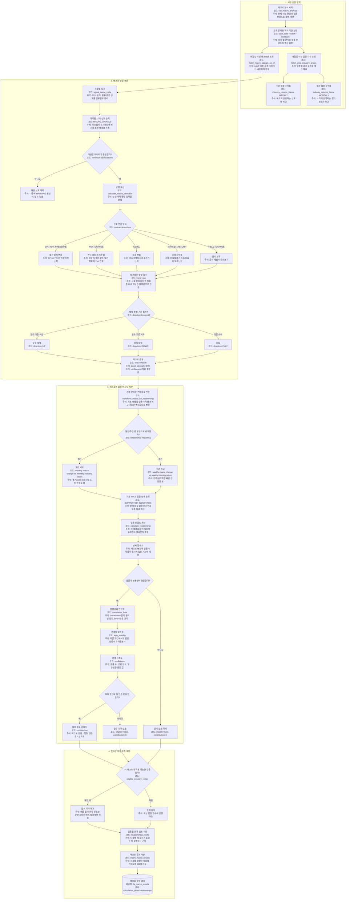

# macro 관계분석 상세

근거 코드:

- `apps/worker/analyzer/macro_job.py`
- `apps/worker/analyzer/relationships.py`
- `apps/worker/fa_contract.py::MACRO_SIGNALS`

저장되는 설명 가능성:

| 확인 값 | 주석 |
|---|---|
| `fa_macro_results.direction_code` | 현재 매크로 신호가 상승 압력, 하락 압력, 중립 중 어디인지 |
| `fa_macro_results.trend_raw` | 서로 단위가 다른 지표를 비교 가능하게 바꾼 방향 점수 |
| `calculation_detail.relationships[].correlation` | 해당 매크로와 업종 수익률이 과거에 얼마나 같이 움직였는지 |
| `calculation_detail.relationships[].relationship_confidence` | 샘플 수, 상관 강도, 일관성을 반영한 관계 신뢰도 |
| `calculation_detail.relationships[].contribution` | 이 매크로가 특정 업종 점수에 실제로 더하거나 뺀 영향 |
| `calculation_detail.relationships[].is_eligible` | 정책상 해당 매크로를 그 업종 판단에 써도 되는지 |
