# run lifecycle 상세

근거 코드:

- `apps/worker/__main__.py::run_analyze`
- `apps/worker/analyzer/pipeline.py::build_request`
- `apps/worker/analyzer/pipeline.py::prepare_run`
- `apps/worker/analyzer/pipeline.py::run`

```mermaid
flowchart TB
    subgraph CLI["0. 실행 명령 읽기"]
        A["사용자가 월간 분석 명령 실행<br/>코드: python -m apps.worker analyze target options"] --> B["명령 옵션 해석<br/>코드: _parse_args<br/>주석: target=어디까지 분석할지, publish=운영 반영 여부"]
        B --> C["분석 명령 진입<br/>코드: run_analyze(args)<br/>주석: CLI에서 받은 값을 Analyzer 실행으로 넘김"]
        C --> D["전략 설정 로드<br/>코드: load_analyzer_config<br/>주석: 기본 전략명은 risk_neutral"]
        C --> E["DB 연결과 worker 설정 로드<br/>코드: _init<br/>주석: 저장소 연결과 공통 설정을 준비"]
    end

    subgraph REQUEST["1. 분석 요청 정리"]
        D --> F["분석 날짜와 옵션 정리<br/>코드: build_request<br/>주석: 사용자가 생략한 날짜를 운영 기준으로 보정"]
        E --> F
        F --> G{"날짜 옵션이 비어 있나?<br/>코드: cutoff/effective/analysis_month"}
        G -->|cutoff 없음| H["데이터 마감일을 오늘로 설정<br/>코드: cutoff = _today_kst<br/>주석: cutoff는 분석에 쓸 수 있는 마지막 데이터 날짜"]
        G -->|effective 없음| I["적용일을 마감일과 같게 설정<br/>코드: effective = cutoff<br/>주석: effective는 Trader가 새 후보군을 적용할 날짜"]
        G -->|analysis_month 없음| J["분석월을 적용일의 월초로 설정<br/>코드: analysis_month = effective month 1일<br/>주석: 월간 리밸런싱 묶음의 기준월"]
        H --> K["요청 값 검증<br/>코드: AnalysisRequest.validate<br/>주석: 실행 범위, 날짜 순서, 발행 조건을 확인"]
        I --> K
        J --> K
        G -->|모두 명시| K
        K --> L{"요청이 실행 가능한가?<br/>코드: validate result"}
        L -->|허용되지 않는 target| X1["실행 중단<br/>코드: ValueError<br/>주석: 허용되지 않는 분석 범위"]
        L -->|cutoff가 effective보다 늦음| X2["실행 중단<br/>코드: ValueError<br/>주석: 데이터 마감일이 적용일보다 늦으면 시점이 꼬임"]
        L -->|publish인데 target이 all 아님| X3["실행 중단<br/>코드: ValueError<br/>주석: 운영 발행은 전체 분석 결과에서만 가능"]
        L -->|OK| M["분석 파이프라인 실행<br/>코드: pipeline.run"]
    end

    subgraph PREP["2. 분석 run 준비"]
        M --> N["모델 설정 검증<br/>코드: config.validate, FaV1Config.validate<br/>주석: 업종 수, 종목 수, 점수 기준 같은 정책값 확인"]
        N --> O["원천 데이터 준비도 검사<br/>코드: validate_source_readiness<br/>주석: Collector 데이터가 부족하면 여기서 중단"]
        O -->|준비도 FAIL| X4["준비도 실패<br/>코드: SourceReadinessError<br/>주석: 분석 이력도 만들지 않음"]
        O -->|준비도 PASS/WARNING| P["활성 전략 조회<br/>코드: fetch_active_strategy<br/>주석: 어느 전략의 후보군인지 확정"]
        P --> Q["오래 멈춘 실행 정리<br/>코드: fail_stale_analysis_runs<br/>주석: 같은 월 RUNNING이 1시간 넘으면 FAIL"]
        Q --> R["입력 지문 생성<br/>코드: _analysis_input_hash<br/>주석: 같은 데이터/설정/날짜면 재사용"]
        R --> S["분석 실행 생성 또는 재사용<br/>코드: get_or_create_analysis_run<br/>주석: 같은 입력이면 중복 계산을 줄임"]
    end

    subgraph REUSE["3. 기존 결과 재사용 분기"]
        S --> T{"같은 입력의 성공/경고 run이 있나?<br/>코드: same input_hash and status != FAIL<br/>주석: 같은 조건의 결과를 재사용할 수 있는지 확인"}
        T -->|예| U["기존 분석 결과 재사용<br/>코드: AnalysisRunContext created=false<br/>주석: 이미 검증된 같은 결과를 다시 사용"]
        T -->|아니오 또는 force| V["새 분석 실행 생성<br/>테이블: fa_analysis_runs<br/>상태: RUNNING, 새 run_version<br/>주석: 이번 입력으로 새 결과를 계산"]
        U --> W{"기존 결과를 운영 반영할까?<br/>코드: request.publish and target=all<br/>주석: 계산은 재사용하고 후보군 발행만 수행할지 결정"}
        W -->|예| Y["기존 run 발행<br/>코드: publish_universe cached run<br/>주석: 재계산 없이 universe만 반영"]
        W -->|아니오| Z["기존 결과 반환<br/>주석: 재계산 없음"]
    end

    subgraph STAGES["4. 새 분석 실행 단계"]
        V --> S1["기업 분기 재무 점수 갱신<br/>코드: refresh_quarterly_scores<br/>테이블: company_quarter_fa<br/>주석: 기업별 재무 품질 원장 작성"]
        S1 --> S2["매크로 환경과 업종 민감도 분석<br/>코드: run_macro_analysis<br/>테이블: fa_macro_results<br/>주석: 시장 환경이 업종에 주는 영향을 계산"]
        S2 --> S3{"매크로까지만 보는 target인가?<br/>코드: target == macro<br/>주석: 업종/기업 선정 없이 매크로 결과만 확인"}
        S3 -->|예| E1["상태 저장 후 종료<br/>상태: PASS 또는 WARNING"]
        S3 -->|아니오| S4["업종 점수와 후보 업종 선정<br/>코드: run_sector_analysis<br/>테이블: fa_sector_results<br/>주석: 최종 투자할 업종 후보를 고름"]
        S4 --> S5{"업종까지만 보는 target인가?<br/>코드: target == sector<br/>주석: 기업 선정 없이 업종 결과까지만 확인"}
        S5 -->|예| E2["상태 저장 후 종료<br/>상태: PASS 또는 WARNING"]
        S5 -->|아니오| S6["업종 안에서 기업 후보 선정<br/>코드: run_company_selection<br/>테이블: fa_company_results<br/>주석: 업종별 상위 종목을 선정하거나 제외 사유 저장"]
        S6 --> S7{"기업까지만 보는 target인가?<br/>코드: target == company<br/>주석: 발행 검증 없이 기업 결과까지만 확인"}
        S7 -->|예| E3["상태 저장 후 종료<br/>상태: PASS 또는 WARNING"]
        S7 -->|아니오, all| S8["최종 결과 검증<br/>코드: validate_run<br/>주석: 미래 데이터, 후보 수, 매수 차단 위반 확인"]
        S8 --> S9["최종 상태 저장<br/>상태: PASS/WARNING/FAIL<br/>테이블: fa_analysis_runs"]
        S9 --> S10{"운영 후보군으로 발행할까?<br/>코드: publish requested and PASS/WARNING"}
        S10 -->|예| Y
        S10 -->|아니오| Z2["분석 결과만 반환<br/>주석: Trader 후보군은 미변경"]
    end

    subgraph FAIL["5. 단계 실패 처리"]
        S1 -. "단계 예외" .-> F1["실패 상태 저장<br/>코드: update status FAIL<br/>주석: failure_reason에 예외 종류와 메시지 기록"]
        S2 -. "단계 실행 예외<br/>코드: _run_stage exception" .-> F1
        S4 -. "단계 실행 예외<br/>코드: _run_stage exception" .-> F1
        S6 -. "단계 실행 예외<br/>코드: _run_stage exception" .-> F1
        S8 -. "단계 실행 예외<br/>코드: _run_stage exception" .-> F1
    end
```

핵심 해석:

- readiness `FAIL`은 `fa_analysis_runs`를 만들기 전에 차단된다.
- 같은 input hash의 FAIL이 아닌 run은 재사용된다.
- `--force`는 재사용을 건너뛰고 새 `run_version`을 만든다.
- cached run도 `--publish` 요청이면 발행 단계만 탈 수 있다.
