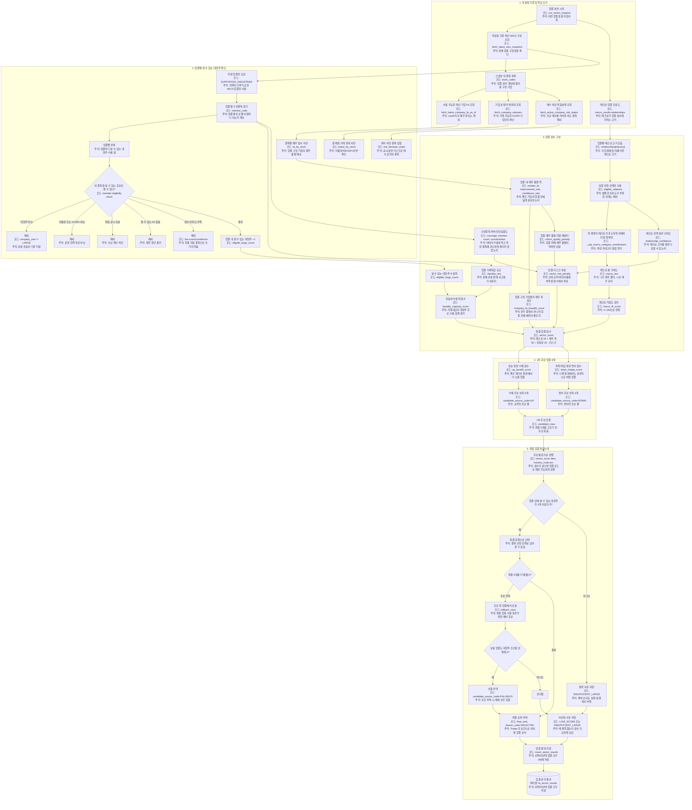

# sector 점수선정 상세

근거 코드: `apps/worker/analyzer/sector_job.py`

투자자에게 설명할 때는 `sector_score` 하나만 보지 말고 아래 조합을 같이 본다.

| 질문 | 확인 컬럼 | 주석 |
|---|---|---|
| 매크로 때문에 오른 점수인가 | `macro_fit_score`, `macro_contributions` | 현재 시장 환경이 이 업종에 얼마나 유리하게 작용했는지 |
| 업종 내 재무 폭이 좋은가 | `company_fa_breadth_score`, `company_coverage_rate` | 업종 전체에 재무적으로 괜찮은 기업이 충분히 있는지 |
| 실제 매수 가능한 대형주가 충분한가 | `eligible_large_count` | 업종을 선택해도 실제로 담을 수 있는 대형주 후보가 있는지 |
| 후보였는데 왜 탈락했나 | `candidate_source_code`, `reason_code` | 수혜/방어/보충 후보였는지와 최종 탈락 사유 |
