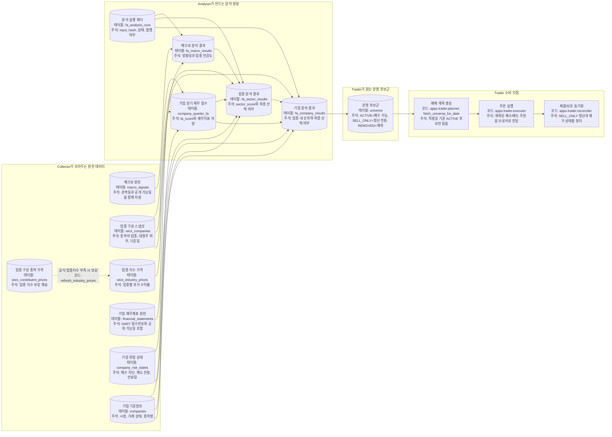
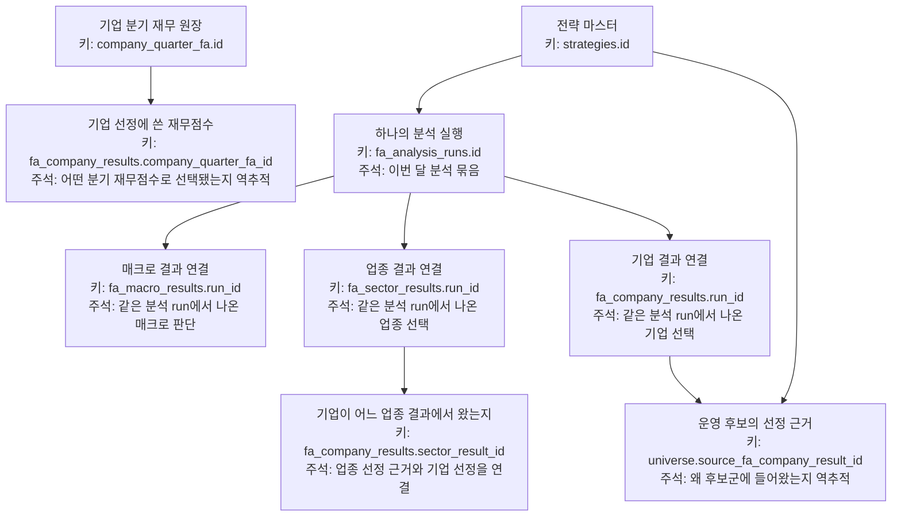

# storage lineage 상세

근거 코드:

- `storage/postgres/schema/06_fa_analysis_schema.sql`
- `storage/postgres/repositories/fa_analysis_repo.py`
- `storage/postgres/repositories/universe_repo.py`

## key relationships

## point-in-time guard columns

| 테이블 | 기준 컬럼 | Analyzer 사용 | 주석 |
|---|---|---|---|
| `macro_signals` | `available_date`, `observation_date` | `available_date &lt;= cutoff_date` | 분석일 당시 공개된 매크로만 사용 |
| `financial_statements` | `available_date`, `source_rcept_no` | cutoff 기준 최신 정기보고서 | 아직 공시되지 않은 재무제표를 미리 쓰지 않음 |
| `company_quarter_fa` | `available_date` | 기업 선정 시 cutoff 이후 자료 배제 | 기업 재무 점수도 시점 오염을 막음 |
| `wics_companies` | `base_date` | cutoff 이전 최신 WICS snapshot | 당시 업종 구성과 대형주 여부를 기준으로 판단 |
| `wics_industry_prices` | `price_date` | cutoff 이전 업종 수익률 | 미래 업종 가격 움직임을 관계 분석에 섞지 않음 |
| `company_risk_states` | `effective_date`, `expires_at` | cutoff/effective date 기준 매수 차단 | 적용일에 매수 금지인 종목을 후보군에서 제외 |
