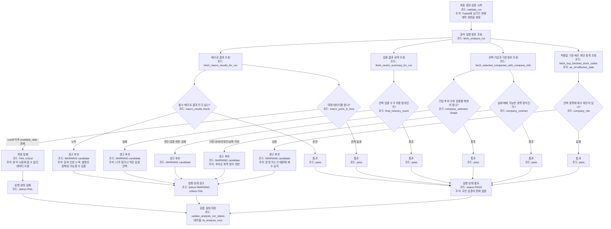
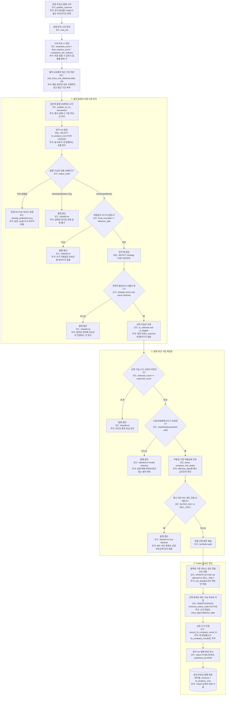
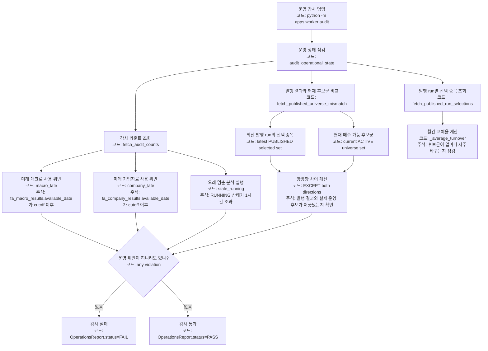

# validation publish audit 상세

근거 코드:

- `apps/worker/analyzer/validation.py`
- `apps/worker/analyzer/universe_job.py`
- `apps/worker/analyzer/operations.py`
- `storage/postgres/repositories/universe_repo.py::publish_fa_run`

## 결과 검증과 상태 결정

## universe 발행 transaction

## 운영 감사

