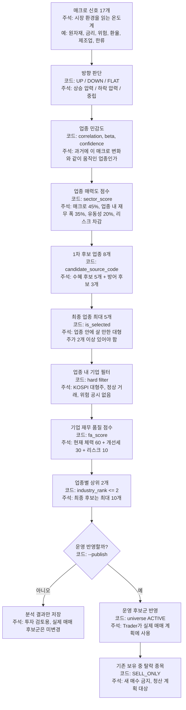

# 투자자 의사결정 흐름

이 그림은 투자자 관점의 의사결정 흐름이다. 개발자 관점의 함수/테이블 상세는 [[run_lifecycle_상세|run lifecycle 상세]]와 각 단계별 상세 다이어그램을 본다.

투자자가 볼 핵심 질문:

| 질문 | 확인 위치 | 주석 |
|---|---|---|
| 왜 이 업종이 선택됐나 | `fa_sector_results.macro_contributions`, `sector_score`, `reason_code` | 매크로 환경, 업종 내 기업 체력, 유동성을 합산한 업종 매력도와 선택 사유 |
| 왜 이 종목이 선택됐나 | `fa_company_results.fa_score`, `score_confidence`, `industry_rank` | 업종 안에서 재무 품질과 점수 신뢰도가 높아 상위권에 든 종목 |
| 왜 이 종목이 제외됐나 | `fa_company_results.exclusion_reason_code`, `reason` | 재무 점수, 신뢰도, 거래 상태, 위험 상태 중 어떤 조건에서 걸렸는지 |
| 실제 매매 후보인가 | `universe.universe_status_code = ACTIVE` | Trader가 신규 매수 계획에 사용할 수 있는 운영 후보 |
| 기존 보유 청산 대상인가 | `universe.universe_status_code = SELL_ONLY` | 새 매수는 막고 기존 보유분 정리만 허용하는 상태 |
