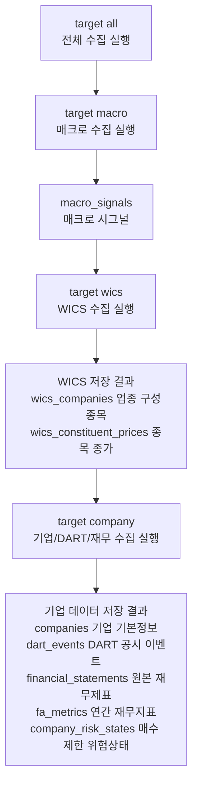

# Collector 수집 데이터 지도

이 폴더는 `apps/worker/collector`가 실제로 모으는 데이터를 투자 시스템 관점에서 설명한다. 핵심 질문은 세 가지다.

1. 정확히 어떤 데이터를 수집하는가?
2. 트레이딩 시스템에서 왜 필요한가?
3. 현재 수집 방식과 라이브러리는 목적에 맞는가?

## 전체 데이터 맵

| 데이터 | 저장 테이블 | 수집 실행 | 트레이딩 시스템에서의 역할 |
|---|---|---|---|
| [[매크로_시그널|매크로 시그널]] | `macro_signals` | `target macro`, `target all` | 시장 국면, 업종 민감도, top-down 업종 선택의 외부 설명 변수 |
| [[WICS_구성종목_스냅샷|WICS 구성종목 스냅샷]] | `wics_companies` | `target wics`, `target all` | 종목의 업종 분류, 분석 유니버스, 시가총액 기반 규모 필터 |
| [[WICS_구성종목_가격|WICS 구성종목 가격]] | `wics_constituent_prices` | `target wics`, `target all` | WICS 업종 수익률 재구성, 업종 모멘텀/상대강도 계산의 가격 원천 |
| [[기업_기본정보|기업 기본정보]] | `companies` | `target company`, `target all` | 종목코드와 DART 고유번호 연결, ACTIVE/KOSPI 분석 대상 확정 |
| [[DART_공시이벤트|DART 공시이벤트]] | `dart_events` | `target company`, `target all` | 재무제표 접수번호 기준, 이벤트 기반 위험/기회 신호 |
| [[DART_재무제표|DART 재무제표]] | `financial_statements`, `fa_metrics` | `target company`, `target all` | 기업 펀더멘털 스코어, 재무 안정성, 현금흐름, 수익성 판단 |
| [[기업_위험상태|기업 위험상태]] | `company_risk_states` | `target company`, `target all` | 유상증자/CB/BW/EB 이후 신규 매수 제한 |

## 실행 단위별 데이터 묶음

## 데이터 품질을 볼 때의 기준

| 기준 | 확인할 내용 |
|---|---|
| 원천 신뢰도 | 공식 API인지, 웹 엔드포인트/비공식 라이브러리인지, 운영 SLA가 있는지 |
| 시점 안전성 | `available_date`, `rcept_dt`, `base_date`가 분석 시점 이전 데이터만 쓰게 하는지 |
| 증분 수집 | 이미 저장된 데이터 이후만 가져오는지, 정정/수정 데이터가 반영되는지 |
| 유니버스 일관성 | WICS, `companies`, DART, 가격 데이터가 같은 종목 집합을 바라보는지 |
| 트레이딩 영향 | 이 데이터가 매수 후보 선정, 매수 차단, 리밸런싱, 매매 계획 중 어디에 쓰이는지 |

## 먼저 읽을 순서

1. [[매크로_시그널|매크로 시그널]]
2. [[WICS_구성종목_스냅샷|WICS 구성종목 스냅샷]]
3. [[WICS_구성종목_가격|WICS 구성종목 가격]]
4. [[기업_기본정보|기업 기본정보]]
5. [[DART_공시이벤트|DART 공시이벤트]]
6. [[DART_재무제표|DART 재무제표]]
7. [[기업_위험상태|기업 위험상태]]
