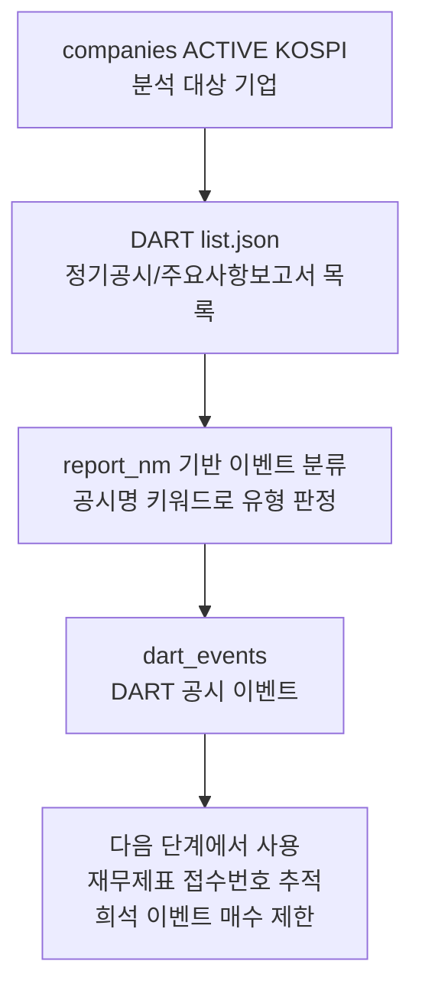

# DART 공시이벤트

관련 실행: [[../01_실행가이드/target_company|target company]]

## 한 줄 정의

DART 공시이벤트는 DART 공시 목록 중 FA와 리스크 관리에 필요한 정기공시와 주요사항보고서를 분류해 저장한 이벤트 데이터다. 재무제표 수집의 기준 접수번호이면서, 일부 자본변동 공시는 매수 제한 상태의 근거가 된다.

## 실제로 수집하는 데이터

| 저장 값 | 의미 |
|---|---|
| `stock_code`, `corp_code` | 종목과 DART 기업 식별자 |
| `rcept_no` | DART 접수번호. `dart_events`의 고유 키 |
| `rcept_dt` | 공시 접수일 |
| `report_nm` | 원문 공시명 |
| `pblntf_ty` | DART 공시 타입. 현재 `A`, `B`만 수집 |
| `event_category_code` | 이벤트 대분류 |
| `event_subtype_code` | 이벤트 세부 유형 |
| `flr_nm`, `corp_cls`, `rm` | 제출자, 법인 구분, 비고 |

## 수집되는 공시 타입과 분류

| DART 타입 | 수집 목적 | 현재 분류 |
|---|---|---|
| `A` 정기공시 | 재무제표 수집 기준 접수번호 확보 | `ANNUAL_REPORT`, `SEMI_ANNUAL_REPORT`, `Q1_REPORT`, `Q3_REPORT` |
| `B` 주요사항보고서 | 이벤트 기반 리스크/기회 감지 | 배당, 자사주, 유상증자, CB/BW/EB, 임상, 품목허가, 기술이전, 대규모계약, 투자결정 등 |

분류는 DART 본문을 읽는 방식이 아니라 `report_nm`의 키워드 매칭으로 수행한다. 분류되지 않은 `OTHER` 이벤트는 저장하지 않는다.

## 트레이딩 입장에서 왜 필요한가

DART 이벤트는 두 방향으로 중요하다.

첫째, 재무제표 수집의 시간 기준이다. Collector는 무작정 `fnlttSinglAcntAll.json`을 호출하지 않고, 먼저 `dart_events`에서 특정 연도/분기의 최신 정기보고서 접수번호를 찾는다. 이 구조 덕분에 재무제표가 어떤 공시에서 온 것인지 추적할 수 있다.

둘째, 리스크 제어 입력이다. 유상증자, 전환사채, 신주인수권부사채, 교환사채 같은 자본변동 이벤트는 [[기업_위험상태|기업 위험상태]]로 파생되어 신규 매수를 차단한다.

장기적으로는 배당, 자사주, 기술이전, 임상, 대규모계약 같은 이벤트를 alpha 또는 risk factor로 확장할 수 있지만, 현재 collector 구현에서는 저장과 일부 위험 파생까지만 담당한다.

## 수집 방식과 라이브러리 평가

| 항목 | 현재 구현 |
|---|---|
| 원천 | DART Open API |
| 엔드포인트 | `list.json` |
| 인증 | `DART_API_KEY` 환경변수 |
| 페이징 | `page_count=100`, `total_page` 기준 반복 |
| 증분 수집 | 종목별 기존 수집 범위를 보고 최근 7일 overlap 재조회 |
| 중복 처리 | `rcept_no` unique upsert |

DART는 공식 원천이므로 공시 수집 방식 자체는 적절하다. 접수번호를 고유 키로 삼고, 7일 overlap을 두는 점도 정정/동일일 공시 누락 위험을 줄이는 데 도움이 된다.

주의할 점은 다음과 같다.

- 현재는 `A`, `B` 타입만 수집한다. 모든 DART 공시 이벤트를 보관하는 구조가 아니다.
- 이벤트 분류는 공시명 키워드 기반이다. 공시명 표현이 바뀌거나 예외 케이스가 생기면 누락 또는 오분류될 수 있다.
- 공시 본문을 파싱하지 않으므로 유상증자 규모, 할인율, CB 전환가액, 계약금액 같은 정량 정보는 현재 저장하지 않는다.
- `OTHER`는 버려지므로 나중에 분류 규칙을 확장하더라도 과거 원문 목록을 모두 재수집해야 할 수 있다.
- API 호출 실패 종목은 콘솔 warning만 남고, 별도 실패 테이블에 저장되지 않는다.

## 데이터 생성 주기

공시는 사건 발생 시점에 생성된다. Collector는 `company_job.run()` 실행 시마다 종목별로 필요한 기간을 재조회한다.

| 상황 | Collector 동작 |
|---|---|
| 신규 종목 | `dart_start_date`부터 `dart_end_date`까지 조회 |
| 기존 수집 이력 있음 | 과거 시작점이 확보된 경우 최신 공시일 7일 전부터 재조회 |
| 같은 접수번호 재수집 | upsert로 최신 분류와 메타데이터 갱신 |

`dart_end_date`는 CLI의 `--end`에서 전달된다. `collect all`에서 `--end`를
생략하면 KST 오늘 기준 전날이 기본값이고, `collect company`에서 `--end`를
생략할 때만 실행 당일을 사용한다.

## 저장 위치와 다음 단계

저장 테이블은 `dart_events`다.

전처리와 upsert 방식은 [[../03_전처리_저장/dart_events_전처리_저장|dart_events 전처리 저장]]을 참고한다.
