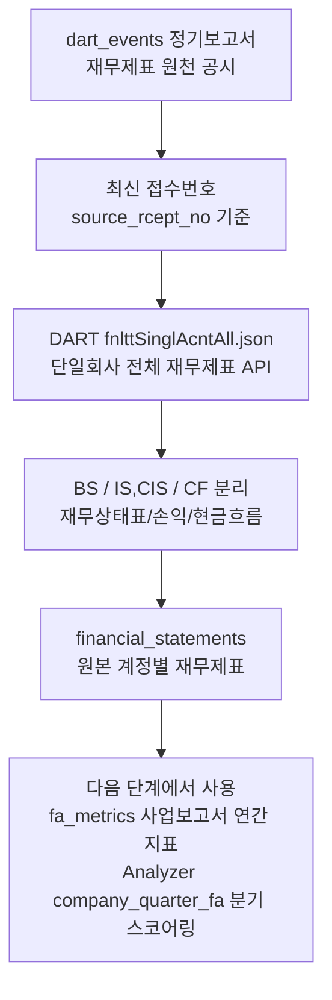

# DART 재무제표

관련 실행: [[../01_실행가이드/target_company|target company]]

## 한 줄 정의

DART 재무제표는 정기보고서 접수번호를 기준으로 수집한 기업의 원본 재무 계정 데이터다. Collector는 재무상태표, 손익계산서/포괄손익계산서, 현금흐름표의 계정별 값을 EAV 형태로 `financial_statements`에 보존하고, 사업보고서 기준 일부 연간 지표를 `fa_metrics`로 계산한다.

## 실제로 수집하는 데이터

| 저장 값 | 의미 |
|---|---|
| `stock_code`, `corp_code` | 종목과 DART 기업 식별자 |
| `bsns_year` | 사업연도 |
| `reprt_code` | DART 정기보고서 코드 |
| `fs_div` | `CFS` 연결재무제표 또는 `OFS` 별도재무제표. 현재 기본값은 `CFS` |
| `sj_div` | `BS`, `IS`/`CIS`, `CF` |
| `account_id`, `account_nm` | DART 계정 ID와 계정명 |
| `source_rcept_no` | 원천 정기보고서 접수번호 |
| `rcept_dt`, `available_date` | 공시 접수일과 분석 가능일 |
| `period_start`, `period_end` | 보고 대상 기간 |
| `thstrm_amount`, `frmtrm_amount`, `bfefrmtrm_amount` | 당기, 전기, 전전기 금액 |
| `thstrm_add_amount`, `frmtrm_add_amount` | DART 누적 금액 원본 |
| `revision_no` | 동일 기간 정정 버전 순서 |

## 수집되는 보고서

| `reprt_code` | 의미 | 기간 월 |
|---|---|---|
| `11013` | 1분기보고서 | 3월 |
| `11012` | 반기보고서 | 6월 |
| `11014` | 3분기보고서 | 9월 |
| `11011` | 사업보고서 | 12월 |

Collector는 `dart_events`에서 정기보고서 접수번호를 먼저 찾고, 그 접수번호에 해당하는 재무제표를 수집한다. 이 구조 때문에 `financial_statements.source_rcept_no`로 원천 공시를 추적할 수 있다.

## 트레이딩 입장에서 왜 필요한가

재무제표는 QuantPilot의 bottom-up 기업 선택에 들어가는 핵심 원천이다.

- 수익성: 순이익, 영업이익률, ROE, ROA
- 안정성: 부채비율, 유동비율
- 현금흐름: 영업활동현금흐름, CAPEX, FCF
- 성장성: Analyzer가 분기 원본을 읽어 YoY 변화와 품질 점수를 계산할 수 있다.
- 편입 가능성: 재무 데이터가 부족하거나 품질이 낮으면 기업 후보에서 제외될 수 있다.

Collector 단계의 `fa_metrics`는 사업보고서(`11011`) 기준 연간 지표를 계산한다. 월간 FA Analyzer는 더 나아가 `financial_statements`를 point-in-time으로 읽어 `company_quarter_fa`를 만든다.

## 수집 방식과 라이브러리 평가

| 항목 | 현재 구현 |
|---|---|
| 원천 | DART Open API |
| 엔드포인트 | `fnlttSinglAcntAll.json` |
| 대상 기업 | 최신 WICS 스냅샷의 ACTIVE KOSPI 기업 |
| 수집 기준 | `dart_events`의 정기공시 접수번호 |
| 기본 재무제표 | `CFS` 연결재무제표 |
| 중복 방지 | 이미 수집한 `source_rcept_no`는 skip |
| 저장 방식 | 원본 계정 구조를 보존하는 EAV |

DART는 공식 원천이고, 정기공시 접수번호를 기준으로 가져오는 방식은 올바른 방향이다. 특히 원본 계정 구조를 보존하므로 나중에 점수 모델을 바꿔도 원천 데이터를 다시 계산할 수 있다.

주의할 점은 다음과 같다.

- 기본은 연결재무제표 `CFS`다. 연결 대상이 없거나 별도 재무제표가 필요한 업종/기업은 추가 정책이 필요하다.
- DART 계정 ID와 계정명은 기업별로 완전히 균질하지 않다. `fa_metrics` 계산은 account_id 우선, account_nm keyword fallback 방식이라 누락 가능성이 있다.
- `available_date`는 현재 `rcept_dt`와 같다. 장중/장마감 공시를 구분하지 않으므로, 당일 장중 분석에 그대로 쓰면 시점 해석을 보수적으로 다시 정해야 한다.
- `period_start`, `period_end`는 보고서 코드의 월을 기준으로 계산한다. 결산월이 12월이 아닌 기업은 추가 검증이 필요하다.
- Collector의 `fa_metrics`는 사업보고서 기준 연간 지표만 계산한다. 분기 스코어링은 Analyzer의 `company_quarter_fa` 생성 단계가 담당한다.

## 데이터 생성 주기

재무제표는 거래일마다 생기는 데이터가 아니라 정기보고서 접수 시점에 생성된다.

| 보고서 | 일반적인 생성 주기 | Collector 동작 |
|---|---|---|
| 1분기보고서 | 연 1회 | `dart_events`에 접수번호가 있으면 수집 |
| 반기보고서 | 연 1회 | `dart_events`에 접수번호가 있으면 수집 |
| 3분기보고서 | 연 1회 | `dart_events`에 접수번호가 있으면 수집 |
| 사업보고서 | 연 1회 | 수집 후 `fa_metrics` 계산 |

`--years`를 주면 해당 사업연도 목록만 수집한다. 미입력 시 `company_job.run()`은 올해 포함 최근 3개년을 대상으로 한다.

## 저장 위치와 다음 단계

저장 테이블은 `financial_statements`와 `fa_metrics`다.

전처리와 upsert 방식은 [[../03_전처리_저장/financial_statements_전처리_저장|financial_statements 전처리 저장]]을 참고한다.
