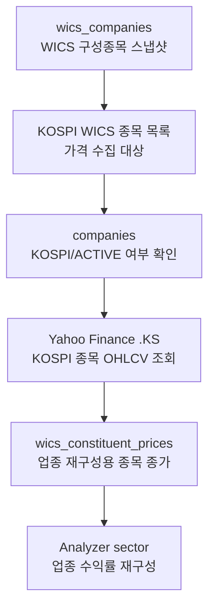

# WICS 구성종목 가격

관련 실행:

- [[../01_실행가이드/target_wics|target wics]]
- [[../01_실행가이드/target_all|target all]]

## 한 줄 정의

WICS 구성종목 가격은 WICS 스냅샷에 포함된 KOSPI 종목의 일별 종가 원천이다. 이름이 `wics_industry_job`이지만, Collector가 직접 저장하는 것은 업종지수 가격이 아니라 업종지수 재구성에 필요한 개별 종목 종가다.

## 실제로 수집하는 데이터

| 저장 값 | 의미 |
|---|---|
| `stock_code` | WICS 구성종목 중 `companies.market_type_code = 'KOSPI'`인 종목 |
| `price_date` | 종가 기준 거래일 |
| `close` | Yahoo Finance에서 받은 공급자 조정 종가 성격의 `Close` |
| `source_code` | 현재는 `YAHOO` |

현재 Collector는 `open`, `high`, `low`, `volume`을 저장하지 않는다. `download_stock_ohlcv()`로 OHLCV를 받지만, `wics_constituent_prices`에는 `close`만 저장한다.

## 트레이딩 입장에서 왜 필요한가

이 데이터는 개별 종목 매매 가격으로 직접 쓰기보다, 업종 선택 모델의 가격 원천으로 쓰인다.

- Analyzer의 sector 단계는 WICS 구성종목 가격을 읽어 업종별 수익률을 재구성할 수 있다.
- 매크로 신호와 업종 수익률의 상관/민감도를 계산하려면 업종 가격 이력이 필요하다.
- 공식 WICS 업종지수 가격이 없거나 부족할 때, 구성종목 종가와 WICS 스냅샷을 조합해 `DERIVED` 업종지수 원천을 만들 수 있다.
- 업종 모멘텀, 상대강도, 시장 대비 강세 업종 판단의 기초가 된다.

중요한 경계는 `wics_industry_prices`다. 해당 테이블은 스키마에 있지만, 이 Collector는 직접 채우지 않는다. Collector는 `wics_constituent_prices`까지만 저장하고, 업종지수 재구성은 Analyzer 쪽 책임이다.

## 수집 방식과 라이브러리 평가

| 항목 | 현재 구현 |
|---|---|
| 대상 종목 | `wics_companies`와 `companies`를 join해 KOSPI 종목만 선택 |
| 가격 원천 | Yahoo Finance |
| 라이브러리 | `yfinance` |
| 티커 형식 | `{stock_code}.KS` |
| 기간 기본값 | 종료일 기준 약 3년 30일 전부터 |
| 증분 방식 | 종목별 최신 `price_date` 다음 날부터 수집 |

현재 방식은 리서치와 FA 업종 재구성에는 실용적이다. 수백 개 KOSPI 종목의 종가를 빠르게 모을 수 있고, 종목별 증분 수집도 되어 있다.

운영 매매 시스템 관점에서는 다음 검증이 필요하다.

- Yahoo Finance는 공식 KRX 데이터 피드가 아니다. 실거래 시스템에서는 결측, 수정주가, 상장폐지 종목, 티커 변경을 별도로 검증해야 한다.
- `.KS`만 사용하므로 KOSDAQ 종목은 가격 수집 대상에서 제외된다. 현재 Analyzer 설정이 KOSPI 중심이므로 구현 의도와 맞지만, KOSDAQ 전략으로 확장하려면 `.KQ` 처리가 필요하다.
- 실패 종목은 `failed_stock_codes`로 반환되지만, DB에 별도 실패 로그를 저장하지 않는다.
- 현재 저장값은 종가뿐이므로 변동성, 거래대금, 유동성 필터를 가격 테이블만으로 계산할 수 없다.
- `auto_adjust=True` 기반 데이터는 수익률 계산에는 유리하지만, 실제 체결 가격과는 다를 수 있다.

## 데이터 생성 주기

가격 자체는 거래일 단위로 생성된다. Collector는 실행 시점마다 종목별 최신 저장일 이후만 추가 수집한다.

| 실행 | 가격 수집 동작 |
|---|---|
| `target wics` | WICS 스냅샷 저장 후 가격 수집까지 실행 |
| `target all` | WICS 스냅샷과 `companies`를 먼저 만든 뒤 마지막 단계에서 가격 수집 |

## 저장 위치와 다음 단계

저장 테이블은 `wics_constituent_prices`다.

전처리와 upsert 방식은 [[../03_전처리_저장/wics_constituent_prices_전처리_저장|wics_constituent_prices 전처리 저장]]을 참고한다.
