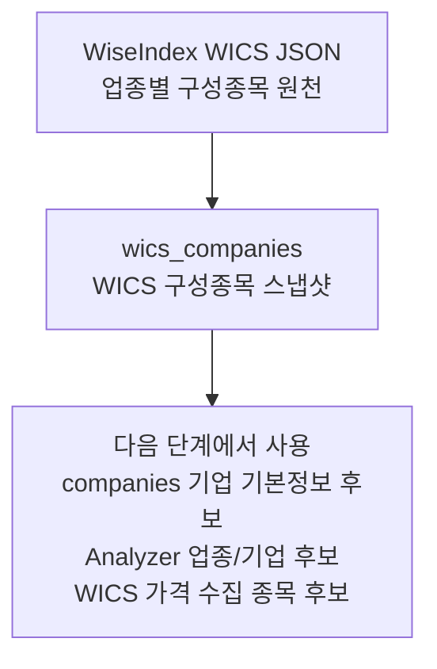

# WICS 구성종목 스냅샷

관련 실행: [[../01_실행가이드/target_wics|target wics]]

## 한 줄 정의

WICS 구성종목 스냅샷은 특정 기준일에 어떤 종목이 어떤 WICS 업종에 속했는지 저장하는 업종 분류 원천이다. Collector는 WiseIndex의 25개 WICS 중분류 구성종목을 날짜별로 가져와 `wics_companies`에 저장한다.

## 실제로 수집하는 데이터

| 컬럼 성격 | 저장 값 | 의미 |
|---|---|---|
| 종목 식별 | `stock_code` | 6자리 국내 종목코드 |
| 기준일 | `base_date` | 이 WICS 구성이 유효한 날짜 |
| 업종 분류 | `sector_code`, `industry_code` | WICS 대분류와 중분류 코드 |
| 시장 규모 | `mkt_val` | WiseIndex 응답의 시가총액 |
| 거래 유동성 | `trd_amt` | WiseIndex 응답의 거래대금 |
| 업종/지수 비중 | `sec_rate`, `idx_rate` | 섹터 내 비중과 전체 지수 내 비중 |
| 규모 분류 | `company_size_code` | 기준일 전체 구성종목을 시가총액 순위로 나눠 `LARGE`, `MID`, `SMALL` 부여 |

수집 대상 WICS 중분류는 `data/collectors/wics_collector.py`의 `WICS_INDUSTRY_CODES`에 있는 25개 코드다. 예를 들어 `G4530` 같은 중분류가 Analyzer의 업종 선택 단위로 사용된다.

## 트레이딩 입장에서 왜 필요한가

WICS 스냅샷은 종목 트레이딩 시스템에서 단순 참고 정보가 아니라, 유니버스와 업종 모델의 기준점이다.

- 종목을 어느 업종 후보에 넣을지 결정한다.
- `companies` 수집 대상은 `wics_companies`에 등장한 종목에서 시작한다.
- `fetch_analysis_companies()`는 최신 WICS 스냅샷의 ACTIVE KOSPI 종목만 분석 대상으로 가져온다.
- `--company-size LARGE` 같은 파라미터는 여기서 만든 `company_size_code`를 사용한다.
- 업종별 후보 기업을 고를 때 같은 WICS 중분류 안에서 비교할 수 있게 해준다.

이 데이터가 틀리면 이후 DART 수집, 재무제표 수집, 업종별 기업 선정이 모두 다른 종목 집합을 바라보게 된다.

## 수집 방식과 라이브러리 평가

| 항목 | 현재 구현 |
|---|---|
| 원천 | WiseIndex JSON 엔드포인트 |
| 호출 방식 | `requests.Session` + `HTTPAdapter` retry |
| URL 형태 | `https://www.wiseindex.com/Index/GetIndexComponets?ceil_yn=0&dt=YYYYMMDD&sec_cd=G####` |
| 파싱 | `pandas.json_normalize` |
| 중복 방지 | 이미 수집된 `base_date`는 기본적으로 건너뜀 |
| 거래일 필터 | `is_krx_trading_day()`가 참인 날짜만 수집 |

현재 방식은 WICS 구성종목을 얻는 목적에는 잘 맞는다. 업종 분류, 시가총액, 거래대금, 비중을 한 번에 받을 수 있고, 날짜별 스냅샷을 저장하므로 과거 업종 구성을 복원할 수 있다.

다만 운영 시스템 관점에서는 다음 리스크가 있다.

- WiseIndex 엔드포인트는 공식 계약형 데이터 피드가 아니라 웹 JSON 엔드포인트다. 응답 구조 변경, 접근 제한, 라이선스 이슈를 고려해야 한다.
- 특정 날짜에 25개 중분류가 모두 수집됐는지 강하게 검증하지 않는다. 일부 중분류 실패가 있어도 해당 날짜의 다른 데이터는 저장될 수 있다.
- `company_size_code`는 WICS 응답의 전체 수집 record를 시가총액 순위로 나눈 값이다. 시장 전체 상장종목 기준 순위가 아니라, 수집된 WICS 구성종목 기준 순위로 이해해야 한다.
- 하나의 종목이 기준일에 하나의 업종에만 속한다는 전제에서 `UNIQUE (stock_code, base_date)`로 저장한다.

## 데이터 생성 주기

코드상 생성 주기는 CLI 입력으로 결정된다.

| 실행 방식 | 생성되는 날짜 목록 |
|---|---|
| `--start`, `--end` 없음 | KST 오늘 날짜 1개 |
| `--wics-snapshot-frequency weekly` | 기간 내 각 ISO 주의 마지막 KRX 거래일 |
| `--wics-snapshot-frequency daily` | 기간 내 모든 날짜 후보를 만들고 저장 단계에서 KRX 거래일만 수집 |

`target all`에서는 `wics_job.run(..., collect_prices=False)`로 먼저 WICS 스냅샷만 저장한다. 이후 `company_job`이 `companies`를 채운 뒤, 마지막에 WICS 구성종목 가격을 수집한다.

## 저장 위치와 다음 단계

저장 테이블은 `wics_companies`다. 이후 흐름은 다음과 같다.

전처리와 upsert 방식은 [[../03_전처리_저장/wics_companies_전처리_저장|wics_companies 전처리 저장]]을 참고한다.
