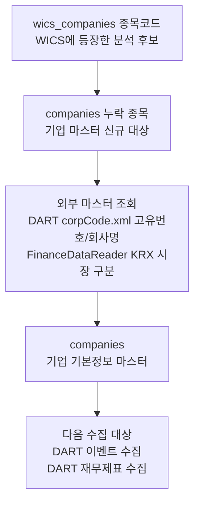

# 기업 기본정보

관련 실행: [[../01_실행가이드/target_company|target company]]

## 한 줄 정의

기업 기본정보는 국내 종목코드, DART 고유번호, 회사명, 거래소, 상장 상태를 연결하는 마스터 데이터다. Collector의 DART 이벤트와 재무제표 수집은 모두 이 매핑을 필요로 한다.

## 실제로 수집하는 데이터

| 저장 값 | 의미 |
|---|---|
| `stock_code` | 국내 6자리 종목코드 |
| `corp_code` | DART Open API 호출에 필요한 8자리 고유번호 |
| `company_name` | DART corpCode.xml 기준 회사명 |
| `market_type_code` | `KOSPI` 또는 `KOSDAQ` |
| `status_code` | `ACTIVE`, `SUSPENDED`, `DELISTED` 중 하나 |

현재 수집 흐름은 WICS에 등장한 종목을 시작점으로 삼는다. 전체 한국 상장사 마스터를 만드는 목적이 아니라, QuantPilot FA 파이프라인이 분석할 수 있는 WICS 기반 종목 집합을 DART와 연결하는 목적이다.

## 트레이딩 입장에서 왜 필요한가

기업 기본정보는 트레이딩 신호 자체는 아니지만, 없으면 데이터 파이프라인이 이어지지 않는다.

- WICS의 `stock_code`를 DART의 `corp_code`로 바꿔야 공시와 재무제표를 가져올 수 있다.
- Analyzer는 최신 WICS 스냅샷에 있고, `companies.status_code = 'ACTIVE'`이며, `market_type_code = 'KOSPI'`인 종목을 분석 대상으로 삼는다.
- 상장폐지 종목을 ACTIVE로 남겨두면 매매 불가능한 종목이 universe에 들어갈 수 있다.
- 거래소 구분은 현재 가격 수집과 Analyzer 범위를 KOSPI로 제한하는 필터다.

## 수집 방식과 라이브러리 평가

| 항목 | 현재 구현 |
|---|---|
| 종목 후보 | `wics_companies`의 distinct `stock_code` |
| DART 식별자 | DART `corpCode.xml` ZIP 다운로드 후 XML 파싱 |
| 거래소 구분 | `FinanceDataReader.StockListing("KOSPI")`, `StockListing("KOSDAQ")` |
| 상태 동기화 | KRX 현재 목록에 없으면 `DELISTED`, 있으면 `ACTIVE` |
| 거래정지 판정 | 현재 `fetch_krx_suspended_codes()`가 빈 set 반환 |

현재 방식은 WICS 기반 KOSPI FA 시스템에는 적절하다. WICS에 들어온 종목만 DART와 연결하므로 불필요한 전체 시장 수집을 줄이고, DART 공식 corp code를 사용한다.

다만 운영 트레이딩 시스템에서는 다음 한계를 명확히 알아야 한다.

- `FinanceDataReader`의 상장 목록은 현재 시점 중심이다. 과거 특정일 기준의 정확한 상장 상태 복원에는 부족하다.
- 거래정지/관리종목 판정은 현재 구현상 동작하지 않는다. `fetch_krx_suspended_codes()`가 항상 빈 set을 반환하므로 `SUSPENDED`는 사실상 생성되지 않는다.
- WICS에 없는 종목은 `companies` 신규 수집 대상이 아니다. 전략을 WICS 외 종목으로 확장하려면 별도 마스터 수집이 필요하다.
- `corp_code`는 `UNIQUE`라서 종목코드 변경, 합병, 재상장 같은 케이스는 운영 전에 별도 데이터 품질 점검이 필요하다.

## 데이터 생성 주기

기업 기본정보는 매일 새 값이 쌓이는 시계열이라기보다 상태성 마스터 데이터다.

| 변경 이벤트 | Collector 반응 |
|---|---|
| WICS에 신규 종목 등장 | `companies`에 없는 종목만 DART corp code 조회 후 저장 |
| KRX 목록에서 사라짐 | `DELISTED`로 상태 변경 |
| KRX 목록에 존재 | `ACTIVE`로 상태 변경 |
| 거래정지 발생 | 현재 구현에서는 감지하지 못함 |

## 저장 위치와 다음 단계

저장 테이블은 `companies`다.

전처리와 upsert 방식은 [[../03_전처리_저장/companies_전처리_저장|companies 전처리 저장]]을 참고한다.
