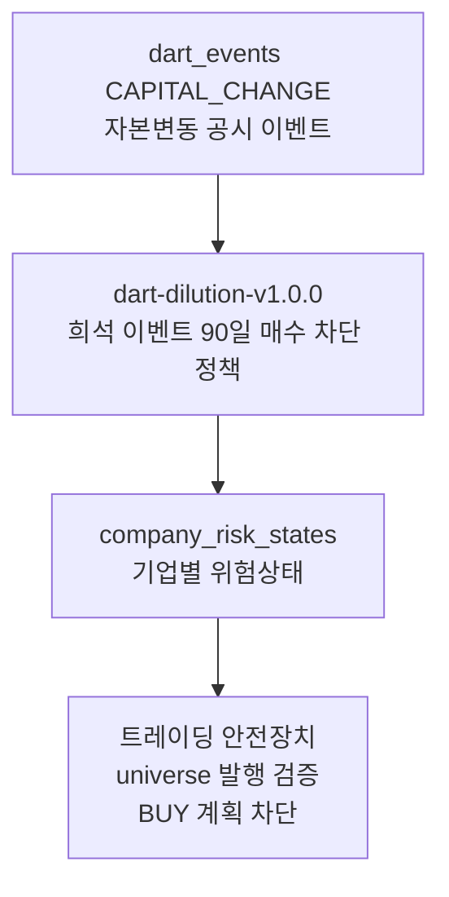

# 기업 위험상태

관련 실행: [[../01_실행가이드/target_company|target company]]

## 한 줄 정의

기업 위험상태는 외부 API에서 직접 받은 데이터가 아니라, DART 자본변동 이벤트에서 파생한 매매 제약 데이터다. 현재 정책은 희석 위험이 있는 이벤트 발생 후 90일 동안 신규 매수를 차단하는 것이다.

## 실제로 생성하는 데이터

| 저장 값 | 의미 |
|---|---|
| `stock_code` | 위험 상태 대상 종목 |
| `risk_action_code` | 현재 자동 생성 값은 `BLOCK_BUY` |
| `reason_code` | 위험 상태를 만든 DART 이벤트 subtype |
| `source_dart_event_id` | 근거가 된 `dart_events.id` |
| `effective_date` | 공시 접수일 기준 적용 시작일 |
| `expires_at` | 적용 종료일. 현재는 시작일 + 90일 |
| `policy_version` | 현재 `dart-dilution-v1.0.0` |
| `is_manual_override` | Collector 자동 생성은 `False` |
| `detail` | 접수번호, 공시명, 차단 일수 |

## 파생 대상 이벤트

현재 `apps/worker/company_risk.py`는 아래 DART 이벤트 subtype만 매수 차단으로 바꾼다.

| DART subtype | 위험 해석 | 자동 조치 |
|---|---|---|
| `PAID_IN_CAPITAL_INCREASE` | 유상증자에 따른 희석 가능성 | 90일 `BLOCK_BUY` |
| `CONVERTIBLE_BOND` | 전환사채 발행에 따른 잠재 희석 | 90일 `BLOCK_BUY` |
| `BOND_WITH_WARRANT` | 신주인수권부사채 발행에 따른 잠재 희석 | 90일 `BLOCK_BUY` |
| `EXCHANGE_BOND` | 교환사채 발행에 따른 주식 수급 부담 가능성 | 90일 `BLOCK_BUY` |

## 트레이딩 입장에서 왜 필요한가

트레이딩 시스템은 좋은 점수의 종목을 찾는 것만큼, 사면 안 되는 종목을 거르는 장치가 중요하다. `company_risk_states`는 그런 hard guard 역할을 한다.

- 유상증자와 메자닌 발행은 기존 주주에게 희석 위험을 만들 수 있다.
- 공시 직후 주가 변동성과 유동성 왜곡이 커질 수 있다.
- Analyzer의 universe 발행 단계는 active `BLOCK_BUY` 또는 `SELL_ONLY` 상태가 있는 선정 종목을 차단한다.
- Trader의 계획 생성 단계도 active 위험 상태가 있으면 BUY 실행을 막는 근거로 사용한다.

즉, 이 데이터는 alpha를 높이기 위한 데이터라기보다 손실 회피와 운영 안전성을 위한 데이터다.

## 수집 방식과 정책 평가

| 항목 | 현재 구현 |
|---|---|
| 원천 | `dart_events`의 `CAPITAL_CHANGE` 이벤트 |
| 정책 | subtype별 고정 90일 매수 차단 |
| 산출 함수 | `derive_company_risk_states()` |
| 저장 함수 | `upsert_company_risk_states()` |
| 중복 기준 | `(stock_code, source_dart_event_id, policy_version)` |

현재 방식은 단순하지만 운영 안전장치로는 타당하다. DART 공식 공시에서 희석 이벤트를 감지하고, 매수 후보에서 자동 제외하는 구조는 실전 시스템에 필요한 방어막이다.

다만 정책은 아직 보수적인 1차 버전이다.

- 모든 대상 이벤트를 동일하게 90일 차단한다. 발행 규모, 할인율, 조달 목적, 기존 시총 대비 비율은 반영하지 않는다.
- 공시 본문을 읽지 않으므로 실제 희석률이나 전환가액 같은 정량 리스크를 계산하지 않는다.
- `SELL_ONLY`나 강제 청산 상태는 자동 생성하지 않는다. 현재 자동 정책은 신규 매수 차단에 초점이 있다.
- table에는 `is_manual_override`가 있지만, Collector는 수동 override를 만들지 않는다.
- 정책 변경 시 과거 row와 새 row가 `policy_version`으로 공존할 수 있으므로, 운영에서는 활성 정책 버전을 명확히 해야 한다.

## 데이터 생성 주기

`company_job.run()`에서 DART 이벤트 수집 직후 실행된다. 따라서 이벤트 수집이 누락되면 위험 상태도 생성되지 않는다.

| 상황 | Collector 동작 |
|---|---|
| 신규 자본변동 공시 수집 | 해당 이벤트를 읽어 `BLOCK_BUY` 상태 생성 |
| 같은 이벤트 재처리 | 같은 정책 버전 기준 upsert |
| 90일 경과 | row를 삭제하지 않고 active 조회 조건에서 제외 |
| 미래 effective date | `as_of_date`보다 미래면 생성하지 않음 |

## 저장 위치와 다음 단계

저장 테이블은 `company_risk_states`다.

전처리와 upsert 방식은 [[../03_전처리_저장/company_risk_states_전처리_저장|company_risk_states 전처리 저장]]을 참고한다.
