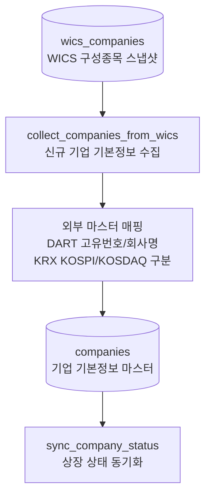

# companies 전처리 저장

관련 데이터: [[../02_수집데이터/기업_기본정보|기업 기본정보]]

## 입력 데이터

- `wics_companies`의 종목코드
- DART corp code 목록
- KRX market map

## 실행 함수

```text
company_job.run
  -> collect_companies_from_wics
  -> sync_company_status
  -> upsert_companies
```

## 전처리 단계

1. `wics_companies`에서 고유 종목코드를 읽는다.
2. `companies`에 이미 있는 종목은 제외한다.
3. DART corp code 목록에서 `corp_code`, `company_name`을 찾는다.
4. KRX market map에서 `market_type_code`를 찾는다.
5. 누락 종목을 `companies`에 upsert한다.
6. 전체 companies를 다시 KRX 현재 목록과 비교해 상태를 동기화한다.

## 저장 테이블

`companies`

primary key:

```text
stock_code
```

## 다이어그램


