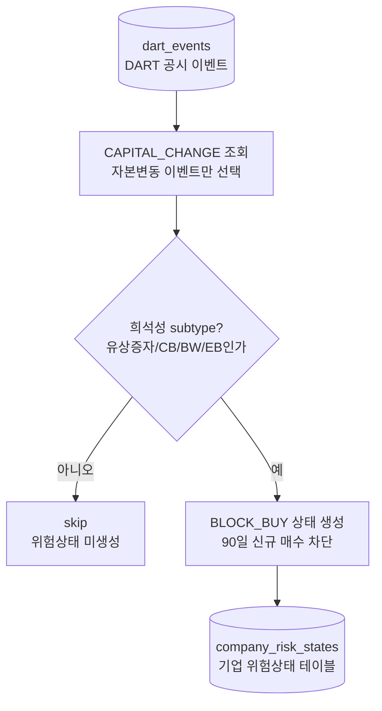

# company_risk_states 전처리 저장

관련 데이터: [[../02_수집데이터/기업_위험상태|기업 위험상태]]

## 입력 데이터

`dart_events` 중 `event_category_code = CAPITAL_CHANGE`

## 실행 함수

```text
company_job.run
  -> refresh_company_risk_states
  -> derive_company_risk_states
  -> upsert_company_risk_states
```

## 전처리 단계

1. `CAPITAL_CHANGE` 이벤트를 조회한다.
2. subtype이 정책 대상인지 확인한다.
3. `risk_action_code = BLOCK_BUY`로 설정한다.
4. `effective_date = rcept_dt`로 설정한다.
5. `expires_at = rcept_dt + 90일`로 설정한다.
6. `detail`에 `rcept_no`, `report_nm`, `block_days`를 저장한다.
7. `policy_version = dart-dilution-v1.0.0`을 기록한다.

## 저장 테이블

`company_risk_states`

upsert 기준:

```text
stock_code, source_dart_event_id, policy_version
```

## 다이어그램


