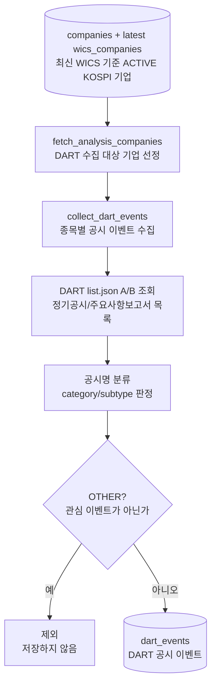

# dart_events 전처리 저장

관련 데이터: [[../02_수집데이터/DART_공시이벤트|DART 공시이벤트]]

## 입력 데이터

DART `list.json` 응답

## 실행 함수

```text
company_job.run
  -> collect_dart_events
  -> fetch_dart_events
  -> _classify_regular_report / classify_dart_event
  -> upsert_dart_events
```

## 전처리 단계

1. 최신 WICS 스냅샷 기준 ACTIVE KOSPI 기업을 고른다.
2. `company_size_codes`가 있으면 규모 필터를 적용한다.
3. 종목별 기존 이벤트 기간을 조회한다.
4. 기존 이력이 충분하면 최신 공시일 7일 전부터 중첩 조회한다.
5. DART A 타입과 B 타입 공시를 조회한다.
6. 공시명으로 category/subtype을 분류한다.
7. `OTHER` 분류는 제외한다.
8. `rcept_dt`를 날짜로 변환한다.

## 저장 테이블

`dart_events`

upsert 기준:

```text
rcept_no
```

## 다이어그램


