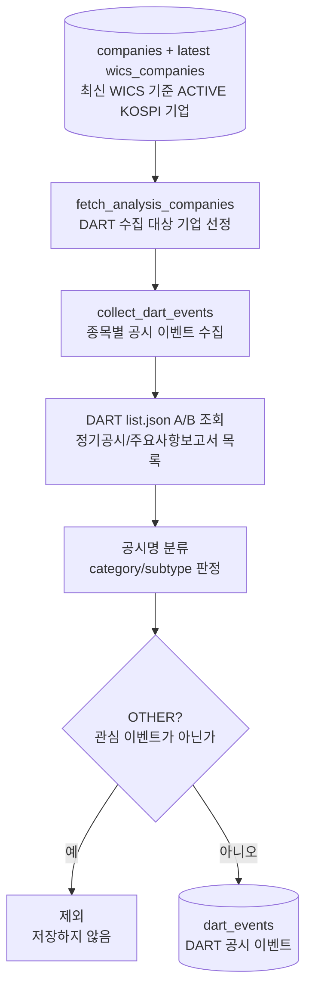

# dart_events 전처리 저장

> **이전 구현 기록:** 아래 내용은 인증 DART API를 사용하던 구현이다.
> 2026-10-04에 해당 클라이언트와 API 전용 로더를 제거했다. 현재 기업 수집은
> 공식 공개 원본 XBRL과 희석 정책 공시만 사용하며 API 키를 요구하지 않는다.
> 현재 실행법·흐름·검증은 [Collector 가이드](../../../apps/worker/collector/README.md)와
> [공개 재무·공시 검증](../../../docs/PUBLIC_DART_ALTERNATIVE_2026-10-04.md)을 참고한다.


관련 데이터: [[../02_수집데이터/DART_공시이벤트|DART 공시이벤트]]

## 입력 데이터

DART `list.json` 응답

## 실행 함수

```text
company_job.run
  -> collect_dart_events
  -> fetch_dart_events
  -> _classify_regular_report / classify_dart_event
  -> upsert_dart_events
```

## 전처리 단계

1. 최신 WICS 스냅샷 기준 ACTIVE KOSPI 기업을 고른다.
2. `company_size_codes`가 있으면 규모 필터를 적용한다.
3. 종목별 기존 이벤트 기간을 조회한다.
4. 기존 이력이 충분하면 최신 공시일 7일 전부터 중첩 조회한다.
5. DART A 타입과 B 타입 공시를 조회한다.
6. 공시명으로 category/subtype을 분류한다.
7. `OTHER` 분류는 제외한다.
8. `rcept_dt`를 날짜로 변환한다.

## 저장 테이블

`dart_events`

upsert 기준:

```text
rcept_no
```

## 다이어그램


```mermaid
flowchart TB
    A[("companies + latest wics_companies<br/>최신 WICS 기준 ACTIVE KOSPI 기업")] --> B["fetch_analysis_companies<br/>DART 수집 대상 기업 선정"]
    B --> C["collect_dart_events<br/>종목별 공시 이벤트 수집"]
    C --> D["DART list.json A/B 조회<br/>정기공시/주요사항보고서 목록"]
    D --> E["공시명 분류<br/>category/subtype 판정"]
    E --> F{"OTHER?<br/>관심 이벤트가 아닌가"}
    F -->|예| G["제외<br/>저장하지 않음"]
    F -->|아니오| H[("dart_events<br/>DART 공시 이벤트")]
```
