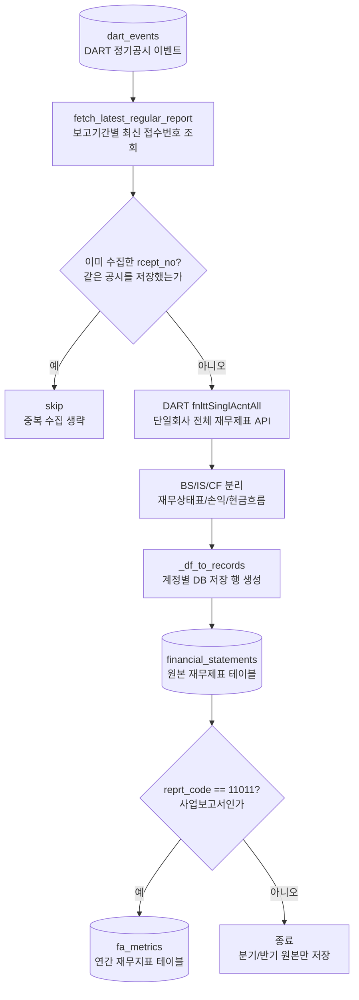

# financial_statements 전처리 저장

관련 데이터: [[../02_수집데이터/DART_재무제표|DART 재무제표]]

## 입력 데이터

DART `fnlttSinglAcntAll.json` 응답

## 실행 함수

```text
company_job.run
  -> collect_financial_statements
  -> fetch_latest_regular_report
  -> fetch_financial_statements
  -> split_by_statement_type
  -> _df_to_records
  -> upsert_financial_statements
```

## 전처리 단계

1. 최신 WICS 스냅샷 기준 ACTIVE KOSPI 기업을 고른다.
2. `company_size_codes`가 있으면 규모 필터를 적용한다.
3. `dart_events`에서 보고서 subtype과 period label로 최신 접수번호를 찾는다.
4. 이미 저장된 접수번호는 스킵한다.
5. DART 재무제표 API를 호출한다.
6. BS, IS/CIS, CF로 분리한다.
7. 금액 문자열에서 쉼표를 제거하고 정수로 변환한다.
8. `source_rcept_no`, `rcept_dt`, `available_date`, `period_start`, `period_end`, `revision_no`를 record에 넣는다.
9. 사업보고서 `11011`이면 `fa_metrics`를 갱신한다.

## 저장 테이블

`financial_statements`

upsert 기준:

```text
stock_code, source_rcept_no, fs_div, sj_div, coalesce(account_id, account_nm), account_nm
```

## 다이어그램


