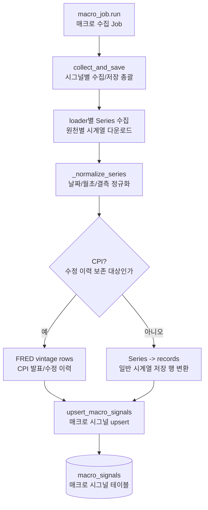

# macro_signals 전처리 저장

관련 데이터: [[../02_수집데이터/매크로_시그널|매크로 시그널]]

## 입력 데이터

`data/loaders`의 각 loader가 반환하는 `pd.Series`

## 실행 함수

```text
macro_job.run
  -> collect_and_save
  -> _normalize_series
  -> _series_to_records / _cpi_vintages_to_records
  -> upsert_macro_signals
```

## 전처리 단계

1. `start`가 없으면 `2010-01-01`을 사용한다.
2. `auto_start=True`로 신호별 최신 저장일 다음 날부터 수집한다.
3. CPI는 최근 90일 lookback으로 vintage를 재조회한다.
4. Series index를 datetime으로 바꾸고 timezone을 제거한다.
5. `MONTHLY`는 월초로 정규화한다.
6. `DAILY`는 최대 5일 forward fill한다.
7. 일반 신호는 관측일 다음 KRX 거래일을 `available_date`로 만든다.
8. CPI는 FRED vintage row의 `available_date`와 `revision_no`를 보존한다.

## 저장 테이블

`macro_signals`

upsert 기준:

```text
signal_name_code, observation_date, revision_no
```

## 다이어그램


