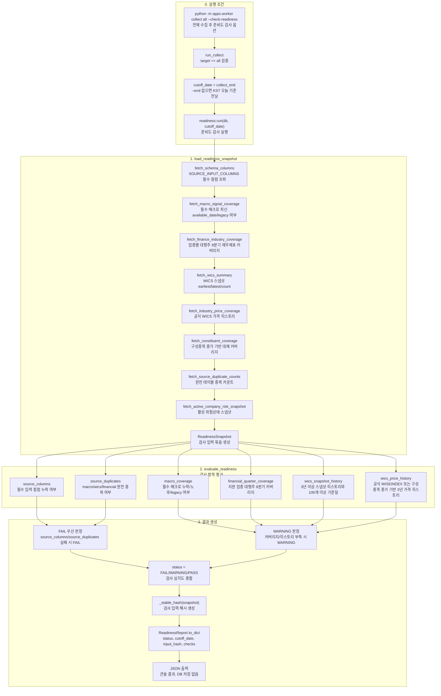

# readiness 검사 흐름

관련 실행: [[../01_실행가이드/target_all|target all]]

## 실행 함수

```text
run_collect
  -> readiness.run
  -> load_readiness_snapshot
  -> evaluate_readiness
```

## 검사 입력

| check | 입력 테이블 |
|---|---|
| `source_columns` | information_schema |
| `macro_coverage` | `macro_signals` |
| `financial_quarter_coverage` | `wics_companies`, `companies`, `financial_statements` |
| `wics_snapshot_history` | `wics_companies` |
| `wics_price_history` | `wics_industry_prices`, `wics_constituent_prices` |
| `source_duplicates` | `macro_signals`, `wics_companies`, `financial_statements` |

추가로 `fetch_active_company_risk_snapshot`이 `company_risk_states`를 조회한다. 현재 구현에서는 별도 `ReadinessCheck`로 PASS/FAIL을 만들지는 않지만, `ReadinessSnapshot`과 `input_hash`에는 포함된다.

## 저장 여부

readiness 결과는 콘솔 JSON으로 출력된다. 현재 Collector 코드에서는 DB 테이블에 저장하지 않는다.

## 다이어그램


