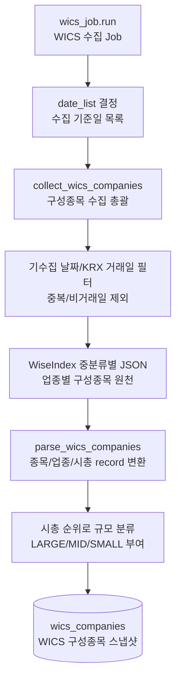

# wics_companies 전처리 저장

관련 데이터: [[../02_수집데이터/WICS_구성종목_스냅샷|WICS 구성종목 스냅샷]]

## 입력 데이터

WiseIndex JSON 응답

## 실행 함수

```text
wics_job.run
  -> collect_wics_companies
  -> fetch_wics_json
  -> parse_wics_companies
  -> upsert_wics_companies
```

## 전처리 단계

1. 이미 수집된 `base_date`를 조회한다.
2. `force_refresh=False`이면 기수집 날짜를 제외한다.
3. KRX 거래일이 아닌 날짜를 제외한다.
4. 중분류 코드별 WiseIndex JSON을 호출한다.
5. `CMP_CD`를 6자리 종목코드로 보정한다.
6. 요청한 중분류 코드를 `industry_code`로 사용한다.
7. `industry_code` 앞 3자리를 `sector_code`로 만든다.
8. `MKT_VAL`, `TRD_AMT`를 숫자로 변환한다.
9. 하루치 전체 종목을 시가총액 순위로 정렬해 `company_size_code`를 만든다.

## 저장 테이블

`wics_companies`

upsert 기준:

```text
stock_code, base_date
```

## 다이어그램


