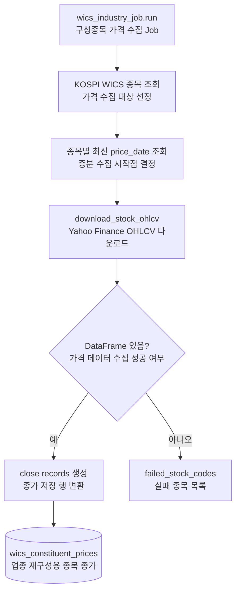

# wics_constituent_prices 전처리 저장

관련 데이터: [[../02_수집데이터/WICS_구성종목_가격|WICS 구성종목 가격]]

## 입력 데이터

Yahoo Finance 기반 OHLCV DataFrame

## 실행 함수

```text
wics_industry_job.run
  -> fetch_kospi_wics_stock_codes
  -> fetch_latest_constituent_price_dates
  -> download_stock_ohlcv
  -> upsert_wics_constituent_prices
```

## 전처리 단계

1. 종목별 최신 `price_date`를 조회한다.
2. `wics_companies`와 `companies`를 조인해 KOSPI WICS 종목을 고른다.
3. 종목별 수집 시작일을 `max(requested_start, latest_date + 1일)`로 정한다.
4. `{stock_code}.KS` 티커로 OHLCV를 다운로드한다.
5. `close`가 있는 행만 record로 만든다.
6. `source_code = "YAHOO"`를 기록한다.
7. 실패 종목은 반환값의 `failed_stock_codes`에 남긴다.

## 저장 테이블

`wics_constituent_prices`

upsert 기준:

```text
stock_code, price_date, source_code
```

## 다이어그램


