# collect all 전체흐름

이 흐름도는 `target=all` 실행 시 실제 호출 순서와 저장 테이블을 함께 보여준다.

```mermaid
flowchart TB
    subgraph CLI["1. CLI/공통 준비"]
        direction TB
        A["python -m apps.worker collect all options<br/>전체 수집 명령"] --> B["run_collect(args)<br/>collect 실행 진입점"]
        B --> C["_init()<br/>설정 로드 + PostgreDB 연결"]
        C --> D["collect_start = _resolve_collect_start(all,start,end)<br/>start 없으면 end 또는 오늘 기준 전일"]
        D --> D2["collect_end = _resolve_collect_end(all,end)<br/>end 없으면 오늘 기준 전일"]
        D2 --> E["show = not --no-progress<br/>진행 출력 여부"]
    end

    subgraph MACRO["2. macro_job.run<br/>매크로 시그널 수집"]
        direction TB
        M1["collect_and_save(auto_start=True)<br/>시그널별 증분 수집"] --> M2["fetch_latest_signal_dates<br/>DB 최신 관측일 확인"]
        M2 --> M3["_SIGNAL_META loop<br/>COPPER, GOLD, WTI, CPI, VIX 등 17개 시그널"]
        M3 --> M4["_normalize_series 또는 CPI vintage 변환<br/>빈도/결측/발표일 정리"]
        M4 --> M5[("macro_signals<br/>매크로 시그널 원천/전처리 결과")]
    end

    subgraph WICS_SNAPSHOT["3. wics_job.run collect_prices=False<br/>WICS 구성종목 스냅샷"]
        direction TB
        W1["_wics_date_list(weekly/daily)<br/>수집 기준일 목록 생성"] --> W2["collect_wics_companies<br/>WiseIndex 업종별 구성종목 조회"]
        W2 --> W3["기수집 날짜 + KRX 거래일 필터<br/>중복/비거래일 제외"]
        W3 --> W4["시가총액 순위 기반 company_size_code 부여<br/>LARGE/MID/SMALL 규모 분류"]
        W4 --> W5[("wics_companies<br/>날짜별 업종 구성종목 스냅샷")]
    end

    subgraph COMPANY["4. company_job.run<br/>기업/DART/재무 데이터"]
        direction TB
        C1["collect_companies_from_wics<br/>WICS 종목을 기업 마스터 후보로 사용"] --> C2[("companies<br/>corp_code/상장시장/상태")]
        C2 --> C3["sync_company_status<br/>KRX 현재 상장 목록 기준 ACTIVE/SUSPENDED/DELISTED 갱신"]
        C3 --> C4["collect_dart_events<br/>정기공시/주요사항보고서 증분 수집"]
        C4 --> C5[("dart_events<br/>접수번호별 공시 이벤트")]
        C5 --> C6["refresh_company_risk_states<br/>증자/CB/BW/EB 공시를 매수 제한 상태로 투영"]
        C6 --> C7[("company_risk_states<br/>BLOCK_BUY 위험상태")]
        C7 --> C8["collect_financial_statements<br/>정기보고서 접수번호로 DART 재무제표 수집"]
        C8 --> C9[("financial_statements<br/>BS/IS/CF 원본 계정 행")]
        C9 --> C10[("fa_metrics<br/>사업보고서 기반 연간 재무지표")]
    end

    subgraph WICS_PRICE["5. wics_industry_job.run<br/>WICS 구성종목 가격"]
        direction TB
        P1["fetch_kospi_wics_stock_codes<br/>KOSPI WICS 대상 종목 조회"] --> P2["fetch_latest_constituent_price_dates<br/>종목별 최신 가격일 확인"]
        P2 --> P3["download_stock_ohlcv(stock.KS)<br/>Yahoo Finance 종가 조회"]
        P3 --> P4[("wics_constituent_prices<br/>업종 지수 재구성용 종목 종가")]
    end

    subgraph READINESS["6. 선택 검사"]
        direction TB
        R1{"--check-readiness?<br/>Analyzer 입력 준비도 검사"} -->|예| R2["readiness.run(cutoff_date)<br/>소스 컬럼/커버리지/중복/위험상태 검사"]
        R2 --> R3["JSON report<br/>콘솔 출력, DB 저장 없음"]
        R1 -->|아니오| R4["종료<br/>DB close"]
    end

    E --> M1
    M5 --> W1
    W5 --> C1
    C10 --> P1
    P4 --> R1
```

구현상 중요한 점:

- `collect all`은 `macro -> WICS 스냅샷 -> company -> WICS 가격` 순서가 고정되어 있다.
- WICS 가격 수집이 뒤로 빠지는 이유는 `wics_industry_job.run`이 `companies`와 연결된 WICS 종목 목록을 사용하기 때문이다.
- `fa_metrics`는 모든 재무제표에서 생성되는 것이 아니라 `reprt_code == 11011`, 즉 사업보고서 수집 후 계산된다.
- `readiness.run`은 수집 결과를 검증하지만 별도 테이블을 만들지 않는다.

관련 노트:

- [[collector_CLI_진입흐름|collector CLI 진입흐름]]
- [[../01_실행가이드/target_all|target all]]
- [[../03_전처리_저장/readiness_검사_흐름|readiness 검사 흐름]]
