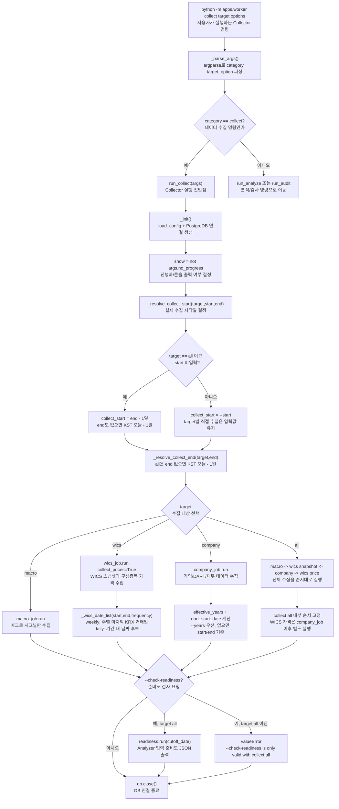

# collector CLI 진입흐름

이 흐름도는 사용자가 입력한 `python -m apps.worker collect ...` 명령이 실제 Collector Job으로 연결되는 공통 실행 경로를 표현한다.

구현상 중요한 점:

- `collect all`에서 `--end`를 생략하면 종료일은 KST 오늘 기준 전일이며, `--start`도 생략하면 시작일도 같은 전일로 맞춘다.
- `target wics`는 `wics_job.run(... collect_prices=True)`라서 스냅샷과 가격을 같이 수집한다.
- `target all`은 먼저 `wics_job.run(... collect_prices=False)`로 스냅샷만 채운 뒤, `company_job` 이후 `wics_industry_job.run`으로 가격을 수집한다.
- `--check-readiness`는 `target all`에서만 허용되며, 결과는 테이블에 저장하지 않고 콘솔 JSON으로 출력한다.

관련 노트:

- [[../01_실행가이드/collector_실행방법|collector 실행방법]]
- [[../01_실행가이드/collector_파라미터_레퍼런스|collector 파라미터 레퍼런스]]
- [[collect_all_전체흐름|collect all 전체흐름]]
