# company 수집흐름

이 흐름도는 `company_job.run`이 기업 마스터, DART 이벤트, 위험상태, 재무제표, 연간 재무지표를 어떤 순서로 만드는지 보여준다.

```mermaid
flowchart TB
    subgraph JOB["0. company_job.run<br/>기업/DART/재무 수집 Job"]
        direction TB
        A["years 결정<br/>--years 또는 최근 3개년"] --> B["dart_end_date = today<br/>DART 이벤트 종료일"]
        B --> C["company_size_codes 전달<br/>LARGE/MID/SMALL 필터 옵션"]
    end

    subgraph MASTER["1. 기업 마스터 생성/동기화"]
        direction TB
        C --> D["collect_companies_from_wics<br/>WICS 종목을 기업 후보로 사용"]
        D --> E["fetch_distinct_stock_codes<br/>wics_companies의 종목코드 조회"]
        E --> F["fetch_all_companies<br/>이미 등록된 companies 조회"]
        F --> G["missing = WICS 종목 - 기존 companies<br/>신규 등록 대상 계산"]
        G --> H{"missing 존재?<br/>새 기업이 있는가"}
        H -->|아니오| I["신규 저장 없음<br/>companies 최신 상태"]
        H -->|예| J["_fetch_corp_codes<br/>DART corp_code 매핑 다운로드"]
        J --> K["_fetch_krx_market_map<br/>KRX 시장 구분 조회"]
        K --> L["_fetch_krx_suspended_codes<br/>거래정지 종목 조회"]
        L --> M["upsert_companies<br/>corp_code, company_name, market_type_code, status_code 저장"]
        M --> N[("companies<br/>기업 기본정보 마스터")]
        I --> O["sync_company_status<br/>기존 companies 상태 동기화"]
        N --> O
        O --> P["_fetch_krx_market_map<br/>현재 KRX 상장 목록 재조회"]
        P --> Q{"market_map 조회 성공?<br/>KRX 목록 확보 여부"}
        Q -->|아니오| R["상태 동기화 생략<br/>기존 상태 유지"]
        Q -->|예| S["ACTIVE/SUSPENDED/DELISTED 판정<br/>상장 목록과 거래정지 목록 비교"]
        S --> T["upsert_companies<br/>상장 상태 갱신"]
    end

    subgraph EVENTS["2. DART 이벤트 수집"]
        direction TB
        T --> U["collect_dart_events(start,end)<br/>공시 이벤트 증분 수집"]
        R --> U
        U --> V["fetch_analysis_companies<br/>ACTIVE KOSPI + WICS 규모 필터 대상"]
        V --> W["fetch_event_date_bounds<br/>종목별 기존 공시 earliest/latest 조회"]
        W --> X["effective_start 계산<br/>기존 이력이 있으면 latest - 7일 중복 조회"]
        X --> Y["_fetch_dart_events<br/>DART list API로 A/B 유형 공시 조회"]
        Y --> Z["공시 분류<br/>정기보고서/자본변동/기타 구분"]
        Z --> AA["upsert_dart_events<br/>rcept_no 기준 이벤트 저장"]
        AA --> AB[("dart_events<br/>접수번호별 DART 공시 이벤트")]
    end

    subgraph RISK["3. 공시 기반 위험상태 투영"]
        direction TB
        AB --> AC["refresh_company_risk_states(as_of_date)<br/>현재일 기준 위험상태 갱신"]
        AC --> AD["fetch_dart_events(event_categories=CAPITAL_CHANGE)<br/>자본변동 공시 조회"]
        AD --> AE["derive_company_risk_states<br/>증자/CB/BW/EB를 BLOCK_BUY로 변환"]
        AE --> AF["expires_at = effective_date + 90일<br/>정책 버전 dart-dilution-v1.0.0"]
        AF --> AG["upsert_company_risk_states<br/>위험상태 저장"]
        AG --> AH[("company_risk_states<br/>매수 제한 위험상태")]
    end

    subgraph FINANCE["4. DART 재무제표와 연간 지표"]
        direction TB
        AH --> AI["collect_financial_statements(years)<br/>정기보고서 기반 재무제표 수집"]
        AI --> AJ["fetch_analysis_companies<br/>재무제표 수집 대상 기업 조회"]
        AJ --> AK["fetch_collected_receipts<br/>이미 저장한 접수번호 조회"]
        AK --> AL["_fetch_company_detail<br/>결산월 acc_mt 조회 및 캐시"]
        AL --> AM["year x reprt_code loop<br/>11013 Q1, 11012 반기, 11014 Q3, 11011 사업보고서"]
        AM --> AN["fetch_latest_regular_report<br/>dart_events에서 기간별 최신 정기보고서 접수번호 선택"]
        AN --> AO{"receipt 없음 또는 이미 수집?<br/>API 호출 필요 여부"}
        AO -->|예| AP["skip<br/>해당 보고서 수집 생략"]
        AO -->|아니오| AQ["_fetch_fs(corp_code,year,reprt_code)<br/>DART 재무제표 API 호출"]
        AQ --> AR["split_by_statement_type<br/>BS 재무상태표, IS 손익계산서, CF 현금흐름표 분리"]
        AR --> AS["_df_to_records<br/>계정 행을 DB 저장 record로 변환"]
        AS --> AT["upsert_financial_statements<br/>원본 계정 행 저장"]
        AT --> AU[("financial_statements<br/>DART 원본 재무제표")]
        AU --> AV{"reprt_code == 11011?<br/>사업보고서인가"}
        AV -->|아니오| AW["분기/반기 종료<br/>원본 재무제표만 저장"]
        AV -->|예| AX["fetch_financial_statements<br/>저장된 사업보고서 행 재조회"]
        AX --> AY["calc_fa_metrics_from_db_rows<br/>연간 투자지표 계산"]
        AY --> AZ["upsert_fa_metrics<br/>연간 재무지표 저장"]
        AZ --> BA[("fa_metrics<br/>연간 재무지표")]
    end
```

구현상 중요한 점:

- `companies`는 WICS 스냅샷에 등장한 종목을 기준으로 보강된다. 따라서 `company_job`은 선행 WICS 스냅샷에 의존한다.
- DART 재무제표는 무작정 모든 보고서를 찾는 것이 아니라, 먼저 `dart_events`에 저장된 최신 정기보고서 접수번호를 사용한다.
- `company_risk_states`는 원천 공시가 아니라 `dart_events`에서 자본변동 이벤트를 읽어 만든 현재 위험상태 테이블이다.
- `fa_metrics`는 `financial_statements` 저장 후 사업보고서(`11011`)에 대해서만 계산된다.

관련 노트:

- [[../02_수집데이터/기업_기본정보|기업 기본정보]]
- [[../02_수집데이터/DART_공시이벤트|DART 공시이벤트]]
- [[../02_수집데이터/DART_재무제표|DART 재무제표]]
- [[../02_수집데이터/기업_위험상태|기업 위험상태]]
