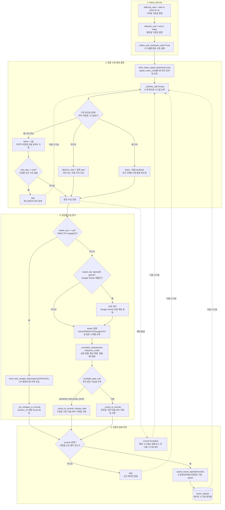

# macro 수집흐름

이 흐름도는 `macro_job.run`에서 `macro_signals` 저장까지의 증분 수집, 원천별 분기, 전처리 방식을 보여준다.

구현상 중요한 점:

- 매크로 수집은 한 시그널이 실패해도 전체 Job을 즉시 중단하지 않고 다음 시그널로 넘어간다.
- CPI는 수정 발표 이력이 중요하므로 최신일 이후만 보는 대신 최근 90일을 다시 조회한다.
- `available_date`는 트레이딩 관점에서 “언제부터 사용할 수 있었는가”를 나타내는 날짜다.
- Google Trends 계열은 호출 제한을 피하기 위해 시그널별 수집 전 대기 시간이 있다.

관련 노트:

- [[../02_수집데이터/매크로_시그널|매크로 시그널]]
- [[../03_전처리_저장/macro_signals_전처리_저장|macro_signals 전처리 저장]]
