# wics 수집흐름

이 흐름도는 `wics_job.run`의 스냅샷 수집과 선택적 가격 수집 경로를 분리해서 보여준다.

```mermaid
flowchart TB
    subgraph CLI["0. CLI에서 날짜 목록 생성"]
        direction TB
        A["target wics 또는 target all<br/>WICS 수집 요청"] --> B["_wics_date_list(start,end,frequency)<br/>기간 옵션을 YYYYMMDD 목록으로 변환"]
        B --> B1{"frequency<br/>스냅샷 수집 간격"}
        B1 -->|weekly| B2["주별 마지막 KRX 거래일<br/>장기 기간 기본값"]
        B1 -->|daily| B3["기간 내 모든 날짜 후보<br/>이후 KRX 거래일 필터 적용"]
        B2 --> C["wics_job.run(date_list)<br/>WICS Job 실행"]
        B3 --> C
        A -->|start/end 모두 없음| C0["date_list = None<br/>wics_job이 KST 오늘로 기본 처리"]
        B -->|기간 내 거래일 없음| C00["date_list = []<br/>오늘으로 대체하지 않고 0건 종료"]
        C0 --> C
        C00 --> C
    end

    subgraph SNAPSHOT["1. WICS 구성종목 스냅샷 저장"]
        direction TB
        C --> D["effective_dates = today only when date_list is None<br/>빈 리스트는 0건 종료"]
        D --> E["collect_wics_companies(effective_dates)<br/>WiseIndex 구성종목 수집"]
        E --> F["fetch_collected_dates<br/>이미 저장된 기준일 조회"]
        F --> G["missing_dates 필터<br/>force_refresh 또는 미수집일 + KRX 거래일"]
        G --> H{"missing_dates 존재?<br/>새로 조회할 날짜가 있는가"}
        H -->|아니오| I["0 반환<br/>스냅샷 저장 생략"]
        H -->|예| J["date loop<br/>기준일별 수집"]
        J --> K["WICS_INDUSTRY_CODES loop<br/>25개 업종 코드 순회"]
        K --> L["fetch_wics_json(date,wics_code)<br/>WiseIndex JSON API 호출"]
        L --> M["parse_wics_companies<br/>종목코드/업종/시총/거래대금 변환"]
        M --> N["day_records 누적<br/>기준일 전체 업종 구성종목 결합"]
        N --> O["mkt_val rank<br/>시가총액 순위 계산"]
        O --> P["company_size_code 부여<br/>LARGE/MID/SMALL 규모 분류"]
        P --> Q["upsert_wics_companies<br/>기준일별 스냅샷 저장"]
        Q --> R[("wics_companies<br/>날짜별 WICS 구성종목")]
    end

    subgraph PRICE["2. 구성종목 가격 저장"]
        direction TB
        R --> S{"collect_prices?<br/>가격 수집을 같이 실행할까"}
        I --> S
        S -->|아니오| T["종료<br/>collect all의 첫 WICS 단계는 여기서 멈춤"]
        S -->|예| U["wics_industry_job.run<br/>구성종목 종가 수집 Job"]
        U --> V["effective_end / requested_start 계산<br/>기본 시작일은 종료일 기준 약 3년+30일 전"]
        V --> W["fetch_latest_constituent_price_dates<br/>종목별 최신 저장 가격일 조회"]
        W --> X["fetch_kospi_wics_stock_codes<br/>KOSPI WICS 대상 종목 목록 조회"]
        X --> Y["stock loop<br/>종목별 effective_start 계산"]
        Y --> Z["download_stock_ohlcv(stock.KS)<br/>Yahoo Finance 일봉 조회"]
        Z --> AA{"frame 비어 있음?<br/>가격 데이터 존재 여부"}
        AA -->|예| AB["failed_stock_codes 추가<br/>실패 종목 목록에 기록"]
        AA -->|아니오| AC["records 생성<br/>stock_code, price_date, close, source=YAHOO"]
        AC --> AD["upsert_wics_constituent_prices<br/>종목별 종가 저장"]
        AD --> AE[("wics_constituent_prices<br/>업종 재구성용 구성종목 종가")]
    end
```

구현상 중요한 점:

- `target all`에서는 `wics_job.run(... collect_prices=False)`로 호출되므로 이 문서의 가격 저장 단계는 첫 WICS 단계에서 실행되지 않는다.
- 가격 수집은 `target wics`이거나 `collect all` 마지막 단계의 `wics_industry_job.run`에서 실행된다.
- `wics_industry_job`이라는 이름이지만 현재 구현은 업종 지수를 직접 저장하지 않고, 업종 지수 재구성을 위한 구성종목 종가를 저장한다.
- 스냅샷은 WiseIndex, 가격은 Yahoo Finance 경로를 사용한다.

관련 노트:

- [[../02_수집데이터/WICS_구성종목_스냅샷|WICS 구성종목 스냅샷]]
- [[../02_수집데이터/WICS_구성종목_가격|WICS 구성종목 가격]]
